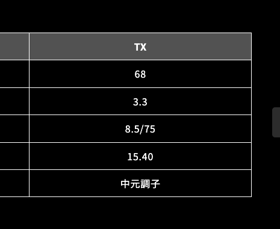

# How to stabilize my driver swing

# Goal

The goal of this document is to summarize how I have stabilized my driver swing.

# Conclusion

> [!NOTE]
> Not completed yet

Starting Jan 11, 2026 until XXX xx, 2026, I was able to:

- ...
- ...

# How I did it

## Know where I am

As of Jan 11, 2026, I want to make sure that I know where I am in terms of my general golf skills, and want to improve my driver while maintaining other performances like putter, iron, and wedge which are decent enough (Already 80s score level)

# I used to be

> [!NOTE]
> Note that I am writing this as if it is already past

I see some top balls as well

|     Swing      | 1/10 | 1/11 |
|:--------------:|:----:|:----:|
| Half swing 60" | 75%  |  71  |
| Half swing 56" | 75%  |  66  |
| Half swing 52" | 75%  |  0*  |
|  Half swing P  | 75%  |      |

`*`: Shank Once

## I need to benchmark well

I realized that I need to benchmark as much as possible to really know where I am at, and also want to make sure my records really present:

- my improvement
- my club fitness

### How I benchmark: Non-Driver

This is my current routine that I take before getting into core routines so that I maintian these skills and my bodies are warmed up:

1. (5 minutes) Stretch
1. 5 random chipshots (60", 56", 52", P) Usually
1. Benchmark: Rotating 60", P, 56", 52" half shot every ball, total of 5 shots each = 20 shots
1. Benchmark: Rotating 9, 8, 7, 6 Full Swing/Full-Swing-But-Short-Stance with consistency (5 shots each = 40 shots)
1. Begins the Driver Benchmark (Plays only Driver Only)

### How I benchmark: Driver

## Options I can think of 

I am using the drvier with:
- Qi LS
- Tour AD VF 6

So I can think as:

1. Buy new Qi4D Driver with Max?
1. Buy less stronger shaft?

But wait, I already have a shorter shaft for my Wood5. Can I use Wood 5?

*https://graphitedesign.gd-inc.co.jp/tourad/tour-ad-vf/*

Want to know my head weight, head speed, swing speed and my shaft's whirling rate.
Cycles Per Minute (CPM)

## Setup: Maybe I gotta learn how to actually do all of them

> [!NOTE]
> 1/12/26

If I can tune all of them, I can get in between of them right?

## Optimal Tee High?