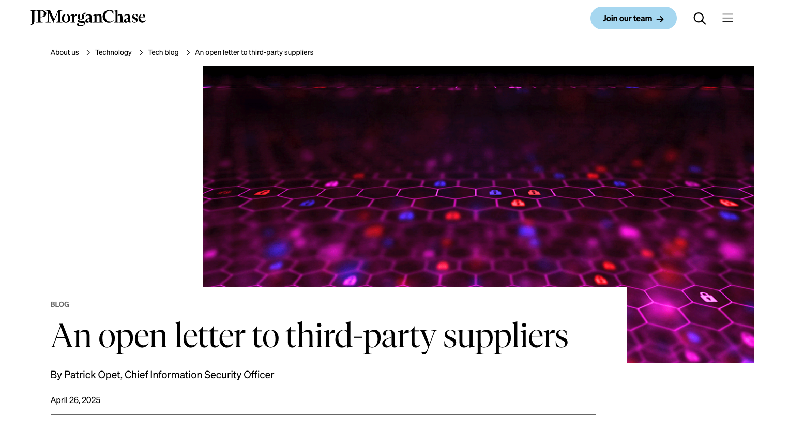

# Goal

https://www.jpmorganchase.com/about/technology/blog/open-letter-to-our-suppliers

<!-- TOC -->

- [Goal](#goal)
- [Result](#result)
- [Read and Analyze](#read-and-analyze)
  - [Today's world with SaaS and its Single Point of Failure](#todays-world-with-saas-and-its-single-point-of-failure)
  - [What the author believes](#what-the-author-believes)
  - [History: Before SaaS](#history-before-saas)
  - [Problem Today](#problem-today)
  - [Morgan's handling cost against the security breach of its 3rd party chatbot partner](#morgans-handling-cost-against-the-security-breach-of-its-3rd-party-chatbot-partner)
  - [Traditional Model vs SaaS Model](#traditional-model-vs-saas-model)
  - [single-factor explicit trust](#single-factor-explicit-trust)
  - [Call-to-action](#call-to-action)

<!-- /TOC -->

# Result

I was able to learn that we are in the shift of traiditonal on-premise world to SaaS world, and this shift brings the concentration risk, which we may think that security level will be the same because we naturally got the benefits of old legacy archtiecture and has not been exposed yet. 

# Read and Analyze

## Today's world with SaaS and its Single Point of Failure

Depending on the SaaS application silently helps cyber attackers as our dependeny can affect global economies, with the following examples:

- CrowdStrike Incident: Leading american cybersecurity company's software has caused 8.5 million systems crashed with Windows Blue Screen, including:
  - Airport
  - Airlines
  - Banks
  - Hospitals
  - Emergency Services
  - Government Agencies

Causing 10 billion US Dollars damage worldwide in 2 hours.

## What the author believes

The author belives that we must focus on security over SaaS integration. But he also admits that we somewhat has to rely on the leading SaaS providers like Google, Microsoft, Okta, etc. This may benefit us like:

- Efficiency
- Quick resolution
- Cost reduction

But this also:

- concetration risk: single points of failure

## History: Before SaaS

Before SaaS, we used to install softwares in our on-premise servers, and this allows attackers to attack every single vector of on-premise of every company, but today's world we only have one vector to attack: the SaaS provider.

## Problem Today

SaaS providers are competing real hard to offer new features to survive to achieve the market share

## Morgan's handling cost against the security breach of its 3rd party chatbot partner

They used to offer the chat bot for the application to know:

- how much balance I have
- how much I spent
- how much I will spend

And the chat service was outside. but once they heard that the API keys are leaked, they immediately stopped the service, which caused the Morgan to do:

- Digital Forensic: Which cost much money and time (billions of log)
- More customer service agents to answer the phone calls: More money
- Handle customer complaints: More money
- Re-anaylize the current service & see if we should find alternatives => More money + time

## Traditional Model vs SaaS Model

In the traditional model, security practices enforced strict segmentation between:

- a firm’s trusted internal resources
- untrusted external interactions

using:

- protocol termination: Basically terminates the connection between internal and external resources, validates and then forwards the request to the internal resources
- tiered access: DMZ, WAS, DB
- Logical Isolation

SaaS Model:

SaaS app or AI agents, with OAuth Token, can access the internal resources directly including:

- API (or DB)

Because the "segmentation" is kinda vague in Cloud.

Also, with the integration purpose, Slack, Google Drive, AI Bot.

Bascially the `ID Token` itself is enough, and we can literally get access into the internal resources, with the token and others can too if they steal the token.

## single-factor explicit trust

SaaS often overly-simplify the security model, and we call this `single-factor explicit trust`.

## Call-to-action

We must always set the security over new implementation (or the same at least).

We should focus on new technologies like:

- Confidential VM
- BYOC

Maybe the old architectures we've been using is not the best way to go for the current world we need a better way to handle the security to stay the same security level in SaaS world.