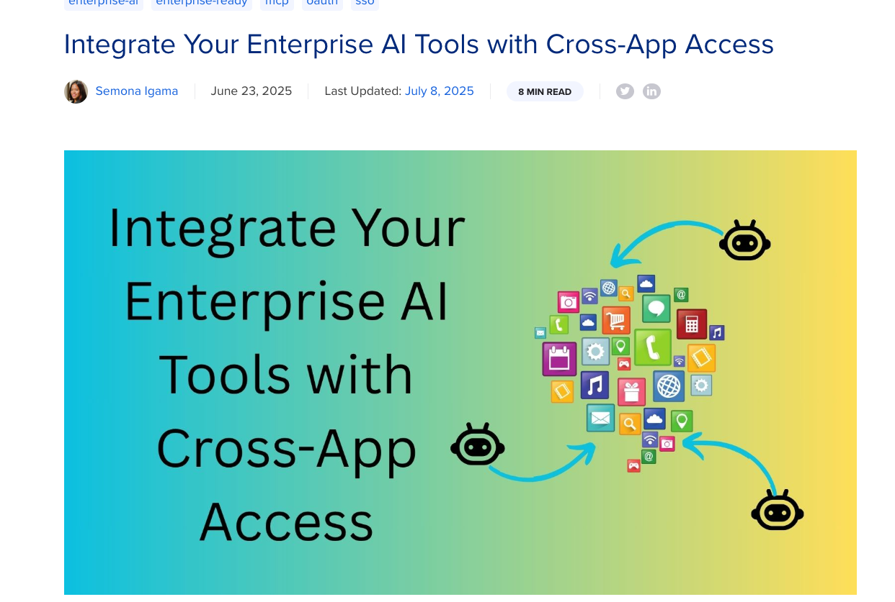
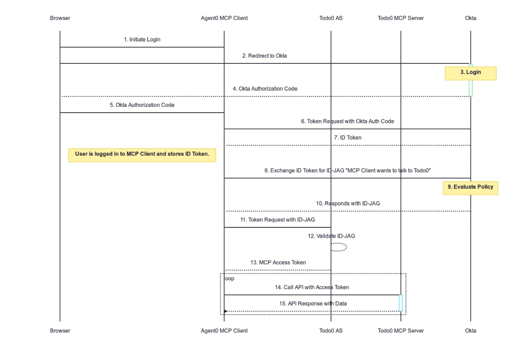

# Goal: Thoroughly understand `Integrate Your Enterprise AI Tools with Cross-App Access`

The goal of this doc is to read the following documentation and understand the fundamentals of how Okta XAA works:

https://developer.okta.com/blog/2025/06/23/enterprise-ai

# Result

> [!NOTE]
> Working on it

Learned that the XAA is really handy as as a corporate standard because:

- Okta (IdP) knows what kind of connections have been made between ai agent and other apps (MCP Servers)
- Okta (IdP) can control permission of connectsion between ai agent and other apps (MCP Servers)
- Okta (IdP) can shut down the connection between ai agent and other apps (MCP Servers) (This depends on the length of the Access Token, but still can shutdown it)
- Users no longer have to agree multiple times for the connection between ai agent and other apps (MCP Servers)
- Users by default don't have to agree for the connection between ai agent and other apps (MCP Servers)

Can explain the following flow:

# Glossary

## Glossary: Oauth

We did have password technology, but also at the sametime we want to give certain permission to certain application to access our data. 

- `O`: Open
- `Auth`: Authorization

Please note that it is NOT `Authentication`, so it is more focused in `Authorization`.

Imagine you have a car, and you want to give your friend permission to drive your car. You don't want to give him your car key/or the trunk key, but you want to give him permission to drive your car. So you give him a valet key, which only allows him to drive your car.

So here is how it works:

1. 3rd party service asks to read the list of contracts in a service
1. Your service then asks you to login to the service
1. Your service will ask if you want him to allow the 3rd party service to access your contracts
1. Your service will then pass the `token` to the 3rd party service

# Read and Analyze

## Analysis: Before AI

The current ID technology for:

- human beings
- non human identityd (NHI) (NOT AI)

Worked reall well with the modern technologies like:

- SAML 2.0: for Single Sign On
- OIDC: & OAuth: What the signed user above can do
- SCIM (System for Cross-domain Identity Management): Adding/Removing employee automates te process

## Anylsis: After AI

What's differnt from the traditional NHI is that AI is quite free and can make creative decisions, where the tradtional NHI only does what it is asked to do, as it usually uses the static script.

## Anaylsis: We do not need specialized entrance for AI

We can simply give the OAuth for the AI agent to access to our place, just like we do for the human being.

## Anaylsis: AI agent vs 

So If I want the following: `Me => AI => Google Drive`,

I need to make sure that I allow `AI` to access to `Google Drive`.

But the problem is, as a corporate, Corporate DOES know that there is a connection between `Me` and `AI`,
but NOT `AI` and `Google Drive`, which can be considered as Shadow IT

## Anaysis 

What's good?

- The exchange happens entirely without user interaction, so the user:
  - never sees prompts or OAuth consent screens
  - never has to allow 20~30 apps
- IdP sits between the exchange, the enterprise admin can configure the policies to determine which applications are allowed to use this direct connection

## Anaylsis: Why not simply client sends its own access token to the client MCP

Because even if you loggined in bad app, and the bad app tries to send the token to the MCP server, the MCP server won't trust it because it is simply a passport 

##