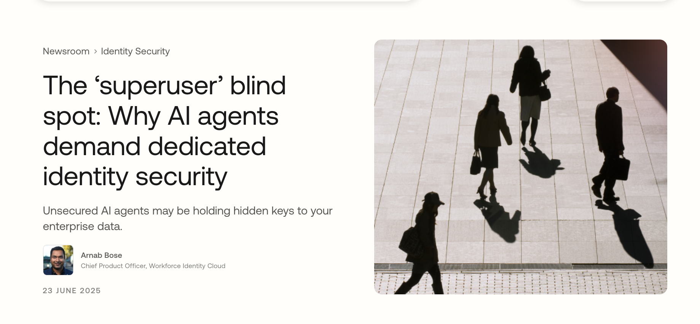

# Goal

Learn about XAA and Okta to realy understand the 

- Current problem we face
- How Athenz solves it with it (How Inc has such obstacles)

## Understand: RAG

- R: `Retrieval`: Basically instead of based on the internal knowledge of its LLM, it retrieves (`searches`) relevant information from external knowledge base
- A: `Augmented`: The search result itself is then augmented as a prompt, as most of the time, user's prompt is not enough to get the nuance of the question, so the `retrived` infrormation is smartly added (`augmented`) as a part of prompt
- G: `Generation`: Generates as it is, but to make it more accurate, it makes sure that the creativity of the LLM is constrained by the retrieved information (Usually `0`, meaning it strictly follows the retrieved information)

## Understand: Shadow IT

- Light: Things that CIO/CISO understand...
- Shadow: Things that CIO/CISO don't understand...

People use non-approved softwares to get their job done, and it is very hard to track them down. It has no evil intention, but it is still a security risk, and people often used the gmail, slack, google drive, google keep etc.

Now most of the softwares above are already pre-installed, which is good but it is now AI paradigm, basically any source codes we post it to the LLM, it may be used to train the LLM, so it is a NEW security risk - or attack surface.

## Understand: NHI, Non-Human Identity

## Understand: `The ‘superuser’ blind spot: Why AI agents demand dedicated identity security`

https://www.okta.com/newsroom/articles/understanding-the-ai-agent-identity-challenge/

It does not matter how strong your security system is if intruders have its key, and this applies for both:
- real world
- digital world

We want the AI, because it is fast/efficient for end users, but again, we need to make sure that the AI:

- does not go against the compliance
- knows what kind of access permissions that ai agent has
- can figure out what kind of permissions right away
