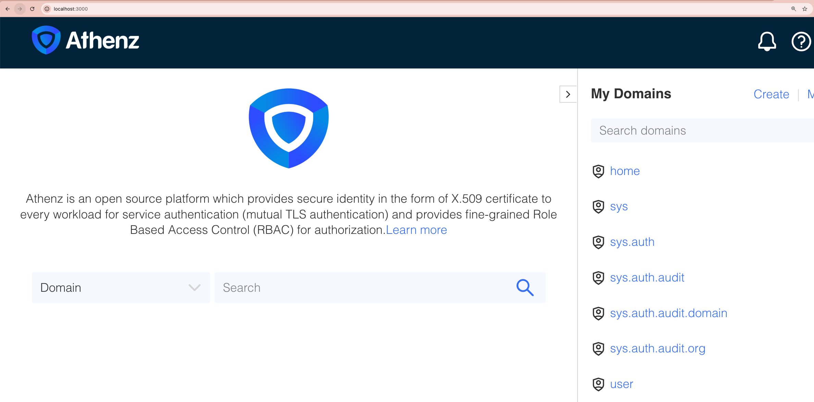
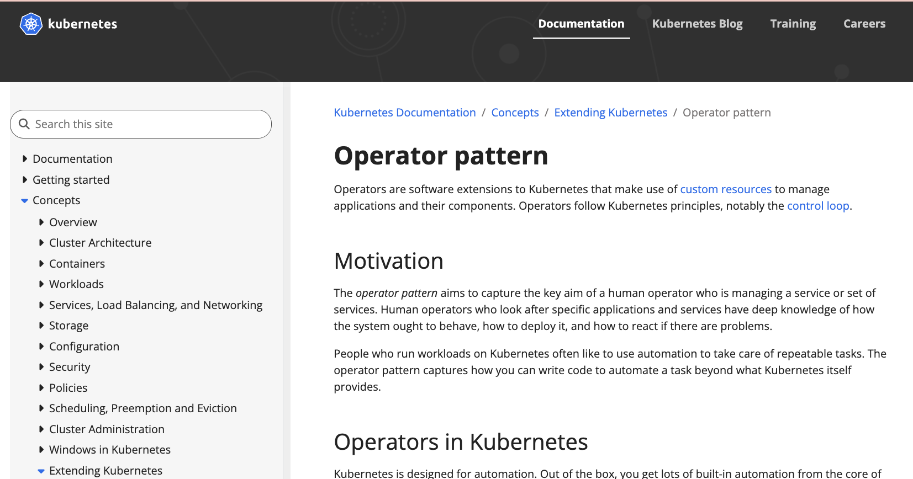
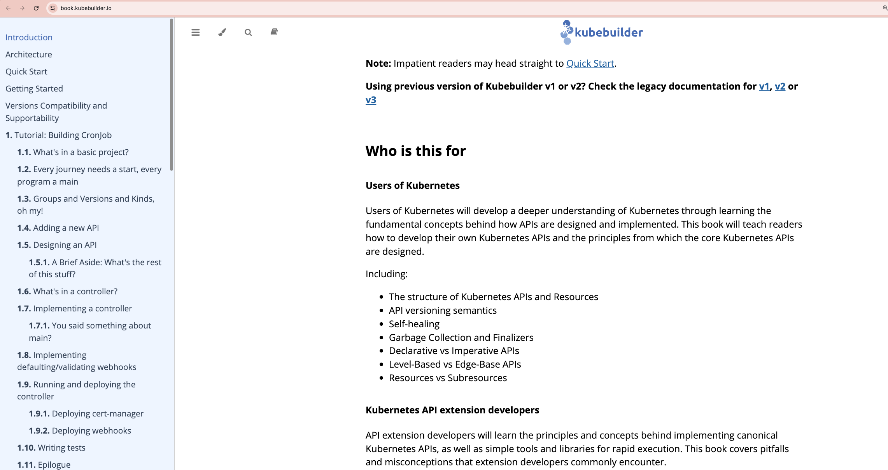

# 🟡 TODO: TITLE ME

<!-- TOC -->

- [🟡 TODO: TITLE ME](#🟡-todo-title-me)
- [Goal](#goal)
- [Background](#background)
- [Conclusion](#conclusion)
- [What I learned](#what-i-learned)
- [Steps for the conclusion](#steps-for-the-conclusion)
  - [Setup](#setup)
    - [Setup: Local Kubernetes Cluster w/ Kind](#setup-local-kubernetes-cluster-w-kind)
      - [Check](#check)
    - [Setup: Athenz Server in Kubernetes Cluster](#setup-athenz-server-in-kubernetes-cluster)
      - [Check](#check-1)
    - [Setup: Athenz ZMS Server Outside](#setup-athenz-zms-server-outside)
      - [Check](#check-2)
    - [Setup: Create TLD beforehand](#setup-create-tld-beforehand)
    - [Setup: Create subdomains](#setup-create-subdomains)
    - [Setup: Kubebuilder](#setup-kubebuilder)
  - [Exp1: Create k8s-athenz-syncer-the-hard-clean-way](#exp1-create-k8s-athenz-syncer-the-hard-clean-way)
    - [Exp1: Initialize Syncer Project](#exp1-initialize-syncer-project)
    - [Exp1: Initialize git](#exp1-initialize-git)
    - [Exp1: Initialize an API](#exp1-initialize-an-api)
      - [Check: Domain](#check-domain)
      - [Check: Repo](#check-repo)
    - [Exp1: Define API](#exp1-define-api)
    - [Exp1: Define Spec](#exp1-define-spec)
    - [Exp1: Register CRD](#exp1-register-crd)
      - [Check](#check-3)
    - [Exp1: Define Controller](#exp1-define-controller)
    - [Exp1: Run Controller](#exp1-run-controller)
    - [Exp1: Define yaml](#exp1-define-yaml)
    - [Exp1: Finally create](#exp1-finally-create)
      - [Check: Log from Controller](#check-log-from-controller)
    - [Exp1: Create an operator that creates Athenz Domain when NS is created in Kubernetes](#exp1-create-an-operator-that-creates-athenz-domain-when-ns-is-created-in-kubernetes)
      - [Check: Operator Log](#check-operator-log)
      - [Check: Athenz Domain](#check-athenz-domain)
    - [Deploy a mock application](#deploy-a-mock-application)
    - [Exp1: Let's create a user in Kubernetes with user name `user.mlajkim`](#exp1-lets-create-a-user-in-kubernetes-with-user-name-usermlajkim)
      - [Check: Get pods in ajktown-api](#check-get-pods-in-ajktown-api)
    - [Exp1: Add user `user.mlajkim` to the role `k8s_ns_admins` in Athenz](#exp1-add-user-usermlajkim-to-the-role-k8s_ns_admins-in-athenz)
      - [Check: Get pods in ajktown-api](#check-get-pods-in-ajktown-api-1)
      - [Check: member inside in ajktown-api](#check-member-inside-in-ajktown-api)
      - [Check: Get pods in ajktown-db](#check-get-pods-in-ajktown-db)
      - [Check: member inside in ajktown-db](#check-member-inside-in-ajktown-db)
- [Dive Records](#dive-records)

<!-- /TOC -->


# Goal

The temporary goal is to build a cluster with Athenz installed, and see


1. exp1: Create a custom k8s-athenz-syncer only with ZMS API, in a hard way
- /domain?prefix={athenzDomain}   (ex: /domain?prefix=shared-kubernetes-cluster-helper)
- /domain/{domainName}/role/{roleName}?auditLog=true&expand=true
1. exp2: Create a custom k8s-athenz-syncer only with ZMS API, in a elegant way with checking updates and other mechanisms that I can think of
1. exp3: Write a guide for deploying the k8s-athenz-syncer with good UI UX so that others can easily deploy and test it out. => This is especially good as I can contribute the team to really work on it (Remember the jenkins day that I did it for them so that they can easily deploy Copper Argos in Jenkins)
1. exp4: Write thoughts and stuff
1. exp5: Maybe I can write some PRs to improve the k8s-athenz-syncer if I find something missing or can be better.


🟡 TODO: The following is temporary:

You guys want to leanr about it but have no idea right? here is the tutorial for you all :)

The goal of this document is to setup a syncer mechanism between Athenz and Kubernettes RBAC by:
- Make really
- Make a custom syncer that syncs from Athenz to K8s RBAC (Good Challenge & Learn a lot about both Athenz and K8s RBAC) only by ZMS
- Then learn how to deploy k8s-athenz-syncer properly with good UI UX and how it is differ
- We can also see what is better and what is missing in the k8s-athenz-sycner and possibly contribute back.
- Maybe I can mock creating the same cluster!

1. Create the similar one only with ZMS API and see how it affects the k8s-athenz-syncer


1. Learn about the core logic of https://github.com/AthenZ/k8s-athenz-syncer with deployment examples
1. Maybe create a very simple deployer for the k8s-athenz-syncer with good UI UX to really make others be able to test => Learn a lot from athenz distribution as I can test Athenz so easy.


🟡 Everything above is temporary (note purpose)

# Background

Why I am doing this!

# Conclusion

🟡 TODO Write me

# What I learned

🟡 TODO Write me

# Steps for the conclusion

## Setup

### Setup: Local Kubernetes Cluster w/ Kind

First of all, we need a kubernetes cluster running locally. We will use `kind` (Kubernetes IN Docker) to create a local cluster.


https://kind.sigs.k8s.io/

```sh
kind create cluster

# Creating cluster "kind" ...
#  ✓ Ensuring node image (kindest/node:v1.34.0) 🖼
#  ✓ Preparing nodes 📦
#  ✓ Writing configuration 📜
#  ✓ Starting control-plane 🕹️
#  ✓ Installing CNI 🔌
#  ✓ Installing StorageClass 💾
# Set kubectl context to "kind-kind"
# You can now use your cluster with:

# kubectl cluster-info --context kind-kind

# Have a question, bug, or feature request? Let us know! https://kind.sigs.k8s.io/#community 🙂
```

#### Check

```sh
k cluster-info
# Kubernetes control plane is running at https://127.0.0.1:55629
# CoreDNS is running at https://127.0.0.1:55629/api/v1/namespaces/kube-system/services/kube-dns:dns/proxy

# To further debug and diagnose cluster problems, use 'kubectl cluster-info dump'.
```

### Setup: Athenz Server in Kubernetes Cluster

Let's first setup the basic Athenz environment. We will use [@ctyano's `athenz-distribution`](https://github.com/ctyano/athenz-distribution) repository:

```sh
test_name=custom_k8s-athenz-syncer

_tmp_dir=$(date +%y%m%d_%H%M%S_$test_name)
mkdir -p ~/test_dive/$_tmp_dir && cd ~/test_dive/$_tmp_dir

git clone https://github.com/ctyano/athenz-distribution.git athenz_distribution
make -C ./athenz_distribution clean-kubernetes-athenz deploy-kubernetes-athenz

# Lots of log ...
# kubectl apply -k athenz-ui/kustomize
# namespace/athenz unchanged
# configmap/athenz-ui-config created
# secret/athenz-admin-keys configured
# secret/athenz-ui-keys created
# service/athenz-ui created
# deployment.apps/athenz-ui created
```


#### Check

> [!TIP]
> If you see `error: unable to forward port because pod is not running. Current status=Pending`,
> Wait for few minutes before pods running
> You can check status in live with `kubectl get deploy athenz-ui -n athenz -w`

> [!TIP]
> It requires some DB spaces, and if you encounter `athenz-db`'s error `Errcode: 28 "No space left on device`
> you can clean it up `docker image prune -a`

Let's do this:

```sh
kubectl -n athenz port-forward deployment/athenz-ui 3000:3000

# Forwarding from 127.0.0.1:3000 -> 3000
# Forwarding from [::1]:3000 -> 3000
```

Then do the following to see the screenshot below:

```sh
open http://localhost:3000
```




### Setup: Athenz ZMS Server Outside

```sh
kubectl -n athenz port-forward deployment/athenz-zms-server 4443:4443
```

#### Check

> [!CAUTION]
> For the test, we will use the root certificate but do not use the root certificate for production use.

Try to connect to the ZMS server with auto generated root certificate from `athenz-manifest`:

```sh
curl -k -X GET "https://localhost:4443/zms/v1/domain" \
  --cert ./athenz_distribution/certs/athenz_admin.cert.pem \
  --key ./athenz_distribution/keys/athenz_admin.private.pem

# {"names":["home","sys","sys.auth","sys.auth.audit","sys.auth.audit.domain","sys.auth.audit.org","user","user.ajkim","user.dev"]}
```

### Setup: Create TLD beforehand

> [!TIP]
> [Source code](https://github.com/AthenZ/athenz/blob/master/core/zms/src/main/rdl/Domain.rdli#L65-L77) for the `POST /domain` API in Athenz ZMS Server.

We need to create a TLD

```sh
curl -k -X POST "https://localhost:4443/zms/v1/domain" \
	--cert ./athenz_distribution/certs/athenz_admin.cert.pem \
	--key ./athenz_distribution/keys/athenz_admin.private.pem \
	-H "Content-Type: application/json" \
	-d '{
		"name": "eks",
		"description": "Elastic Kubernetes Service Domain",
		"org": "ajkim",
		"enabled": true,
		"adminUsers": ["user.athenz_admin"]
	}'

# {"description":"Elastic Kubernetes Service Domain","org":"ajkim","auditEnabled":false,"ypmId":0,"autoDeleteTenantAssumeRoleAssertions":false,"name":"eks","modified":"2025-12-27T03:00:05.421Z","id":"253b65d0-e2d0-11f0-9dea-17c92bf9f5a9"}
```


### Setup: Create subdomains

> [!TIP]
> [Source code](https://github.com/AthenZ/athenz/blob/master/core/zms/src/main/rdl/Domain.rdli#L81-L95) for the `POST /subdomain/{parent}` API in Athenz ZMS Server.

```sh
curl -k -X POST "https://localhost:4443/zms/v1/subdomain/eks" \
	--cert ./athenz_distribution/certs/athenz_admin.cert.pem \
	--key ./athenz_distribution/keys/athenz_admin.private.pem \
	-H "Content-Type: application/json" \
	-d '{
		"parent": "eks",
		"name": "users",
		"description": "EKS Users Subdomain",
		"org": "ajkim",
		"enabled": true,
		"adminUsers": ["user.athenz_admin"]
	}'

# {"description":"Athenz Users Subdomain","org":"ajkim","auditEnabled":false,"name":"eks.users","modified":"2025-12-27T03:02:42.141Z","id":"82a4f8d0-e2d0-11f0-9dea-17c92bf9f5a9"}
```

### Setup: Kubebuilder

If you do not have `kubebuilder` yet, please install it first:

```sh
brew install kubebuilder
```


## Exp1: Create k8s-athenz-syncer-the-hard-clean-way

> [!NOTE]
> Similar concept: [Kubernetes-the-hard-way](https://github.com/kelseyhightower/kubernetes-the-hard-way)

Let's first create something that works, but not elegant *yet*.

https://kubernetes.io/docs/concepts/extend-kubernetes/operator/





https://book.kubebuilder.io/


### Exp1: Initialize Syncer Project

> [!TIP]
> As the `init` implies, you only run once for one repository, and you simply create apis under the same repository.

- `domain`: k8s already has `Pod`, `SA`, `Role`, `RoleBinding`, so we need to specify our own ID so that it does not conflict with existing ones.

```sh
repo="github.com/mlajkim"

mkdir -p k8s-athenz-syncer-the-hard-clean-way && \
(cd k8s-athenz-syncer-the-hard-clean-way && kubebuilder init --domain "ajktown.com" --repo "$repo/k8s-athenz-syncer-the-hard-clean-way")

# Lots of log ...
# go: downloading go.opentelemetry.io/otel/sdk/metric v1.34.0
# Next: define a resource with:
# $ kubebuilder create api
```

### Exp1: Initialize git

To track progress, let's initialize git, and commit the initial state, then create a branch for the experiment:

```sh
git -C k8s-athenz-syncer-the-hard-clean-way init
git -C k8s-athenz-syncer-the-hard-clean-way add .
git -C k8s-athenz-syncer-the-hard-clean-way commit -m "Initial commit: Initialize kubebuilder project"
git -C k8s-athenz-syncer-the-hard-clean-way checkout -b feat/hard-clean-syncer

# Lots of log ...
# Switched to a new branch 'feat/hard-clean-syncer'
```

### Exp1: Initialize an API

The full name will be: `<group>.<domain>/<version>, Kind=<kind>`, as:

```yaml
apiVersion: identity.ajktown.com/v1
kind: AthenzSyncer
...
```

```sh
group="identity"
version="v1"
kind="AthenzSyncer"

(cd k8s-athenz-syncer-the-hard-clean-way && kubebuilder create api --group $group --version $version --kind $kind --resource --controller)

git -C k8s-athenz-syncer-the-hard-clean-way add .
git -C k8s-athenz-syncer-the-hard-clean-way commit -m "Feat: Initialize AthenzSyncer API and Controller"
```

#### Check: Domain

Check domain:

```sh
head -n 1 ./k8s-athenz-syncer-the-hard-clean-way/config/samples/identity_v1_athenzsyncer.yaml
# apiVersion: identity.ajktown.com/v1
```

#### Check: Repo

You can see your domain and repo in the `go.mod` file:

```sh
head -n 1 ./k8s-athenz-syncer-the-hard-clean-way/go.mod
# module github.com/mlajkim/athenz-syncer
```


### Exp1: Define API

So far we only have boilerplate code, and we need to define the oeperator's:

- Spec: Desired State
- Status: Observed State
- Controller: Reconcile loop that brings the current state to the desired state.


### Exp1: Define Spec

Modify `./k8s-athenz-syncer-the-hard-clean-way/api/v1/athenzsyncer_types.go`:

```go
type AthenzSyncerSpec struct {
	// INSERT ADDITIONAL SPEC FIELDS - desired state of cluster
	// Important: Run "make" to regenerate code after modifying this file
	// The following markers will use OpenAPI v3 schema to validate the value
	// More info: https://book.kubebuilder.io/reference/markers/crd-validation.html

	// foo is an example field of AthenzSyncer. Edit athenzsyncer_types.go to remove/update
	// +optional
	Foo *string `json:"foo,omitempty"`

	// `athenzDomain` is the Athenz domain to be synced by this AthenzSyncer.
	// It also syncs all the subdomains under this domain.
	AthenzDomain string `json:"athenzDomain"`

	// `zmsURL` is the ZMS endpoint URL of the Athenz server to sycn against
	ZMSURL string `json:"zmsURL"`
}
```


Then:

```sh
make -C ./k8s-athenz-syncer-the-hard-clean-way manifests
# "~/test_dive/251226_080757_athenz_distribution/my-athenz-syncer/bin/controller-gen" rbac:roleName=manager-role crd webhook paths="./..." output:crd:artifacts:config=config/crd/bases
```

### Exp1: Register CRD

All the files under `config/crd/bases` are applied:

```sh
make -C ./k8s-athenz-syncer-the-hard-clean-way install
...
# customresourcedefinition.apiextensions.k8s.io/athenzsyncers.identity.ajktown.com created
```

#### Check

```sh
k api-resources | grep "ajktown.com"

# athenzsyncers                                    identity.ajktown.com/v1           true         AthenzSynce
```


### Exp1: Define Controller

`internal/controller/athenzsyncer_controller.go`

Replace the original `Reconcile` function with the following:

```go
func (r *AthenzSyncerReconciler) Reconcile(ctx context.Context, req ctrl.Request) (ctrl.Result, error) {
	log := logf.FromContext(ctx)

	var syncer identityv1.AthenzSyncer
	if err := r.Get(ctx, req.NamespacedName, &syncer); err != nil {
		return ctrl.Result{}, client.IgnoreNotFound(err)
	}

	targetDomain := syncer.Spec.AthenzDomain
	zmsURL := syncer.Spec.ZMSURL

	log.Info("Reconciling AthenzSyncer ...", "AthenzSyncer", req.NamespacedName, "Target", targetDomain, "URL", zmsURL)

	tr := &http.Transport{
		TLSClientConfig: &tls.Config{InsecureSkipVerify: true},
	}
	httpClient := &http.Client{Transport: tr}

	fullURL := fmt.Sprintf("%s/domain/%s", zmsURL, targetDomain)

	resp, err := httpClient.Get(fullURL)
	if err != nil {
		log.Error(err, "🔥 Failed to connect to Athenz Server")
	} else {
		defer resp.Body.Close()
		bodyBytes, _ := io.ReadAll(resp.Body)
		bodyString := string(bodyBytes)

		// if response is 200
		if resp.StatusCode == 200 {
			preview := bodyString
			if len(bodyString) > 200 {
				preview = bodyString[:200] + "..."
			}
			log.Info("✅ Athenz Response OK!", "StatusCode", resp.StatusCode, "Data", preview)
		} else {
			log.Info("⚠️ Athenz Returned Error", "StatusCode", resp.StatusCode)
		}
	}

	return ctrl.Result{}, nil
}
```

### Exp1: Run Controller

> [!TIP]
> Please note that `make run` will build and run the controller outside the cluster.

Controller for now works locally to receive your request:

```sh
make -C ./k8s-athenz-syncer-the-hard-clean-way run

# 2025-12-26T11:48:04+09:00	INFO	setup	starting manager
# 2025-12-26T11:48:04+09:00	INFO	starting server	{"name": "health probe", "addr": "[::]:8081"}
# 2025-12-26T11:48:04+09:00	INFO	Starting EventSource	{"controller": "athenzsyncer", "controllerGroup": "identity.ajktown.com", "controllerKind": "AthenzSyncer", "source": "kind source: *v1.AthenzSyncer"}
# 2025-12-26T11:48:04+09:00	INFO	Starting Controller	{"controller": "athenzsyncer", "controllerGroup": "identity.ajktown.com", "controllerKind": "AthenzSyncer"}
# 2025-12-26T11:48:04+09:00	INFO	Starting workers	{"controller": "athenzsyncer", "controllerGroup": "identity.ajktown.com", "controllerKind": "AthenzSyncer", "worker count": 1}
```

### Exp1: Define yaml

`./k8s-athenz-syncer-the-hard-clean-way/config/samples/identity_v1_athenzsyncer.yaml`

```yaml
apiVersion: identity.ajktown.com/v1
kind: AthenzSyncer
metadata:
  labels:
    app.kubernetes.io/name: my-athenz-syncer
    app.kubernetes.io/managed-by: kustomize
  name: athenzsyncer-sample
spec:
  athenzDomain: "eks.users"
  zmsURL: "https://localhost:4443/zms/v1"

```

### Exp1: Finally create

So far we have the running operator locally, but the operator is not seeing any CRD deployed yet in your local cluster. That means the operator will do nothing and keep waiting for your request.

By creating the resource with the following command, the operator will soon notice it and start reconciling it:

```sh
kubectl apply -f ./k8s-athenz-syncer-the-hard-clean-way/config/samples/identity_v1_athenzsyncer.yaml

# athenzsyncer.identity.ajktown.com/athenzsyncer-sample created
```

#### Check: Log from Controller

> [!TIP]
> You will see `🔥 Failed to connect to Athenz Server	{"controller": ...` if the operator cannot connect to the ZMS Server
> To fix it, checkout [Setup: Athenz ZMS Server Outside](#setup-athenz-zms-server-outside)

> [!TIP]
> To fix error `⚠️ Athenz Returned Error	{"controller": ... "StatusCode": 401}`
> You may not present X.509 certificate to the ZMS server, which is required for authentication.

Check out the log from the controller terminal:

```sh
# 2025-12-27T12:41:52025-12-27T12:41:58+09:00	INFO	Reconciling AthenzSyncer ...	{"controller": "athenzsyncer", "controllerGroup": "identity.ajktown.com", "controllerKind": "AthenzSyncer", "AthenzSyncer": {"name":"athenzsyncer-sample","namespace":"default"}, "namespace": "default", "name": "athenzsyncer-sample", "reconcileID": "366e13d0-fadf-4b37-9850-c1ae4e017d05", "AthenzSyncer": {"name":"athenzsyncer-sample","namespace":"default"}, "Target": "eks.users", "URL": "https://localhost:4443/zms/v1"}
# 2025-12-27T12:41:58+09:00	INFO	✅ Athenz Response OK!	{"controller": "athenzsyncer", "controllerGroup": "identity.ajktown.com", "controllerKind": "AthenzSyncer", "AthenzSyncer": {"name":"athenzsyncer-sample","namespace":"default"}, "namespace": "default", "name": "athenzsyncer-sample", "reconcileID": "366e13d0-fadf-4b37-9850-c1ae4e017d05", "StatusCode": 200, "Data": "{\"description\":\"Athenz Users Subdomain\",\"org\":\"ajkim\",\"enabled\":true,\"auditEnabled\":false,\"ypmId\":0,\"autoDeleteTenantAssumeRoleAssertions\":false,\"name\":\"eks.users\",\"modified\":\"2025-12-27T03:02:42.153Z..."}
```


### Exp1: Create an operator that creates Athenz Domain when NS is created in Kubernetes

> [!TIP]
> I first decided against deleting the Athenz domain upon namespace deletion.
> This is to prevent the accidental loss of critical roles if a Kubernetes namespace is deleted in error.
> BUT, I realized this creates a trade-off where stale data may accumulate in the Athenz server,
> potentially leading to namespace name occupancy or collisions in the future.

We can set `--resource=false` as we do not need the CRD (Because `Namespace` is the native Kubernetes resource):

```sh
(cd k8s-athenz-syncer-the-hard-clean-way && kubebuilder create api --group core --version v1 --kind Namespace --controller=true --resource=false)
```


#### Check: Operator Log

You will see the following log in the operator:

```sh
# 2025-12-28T08:26:52+09:00	INFO	Reconciling Namespace Controller ...	{"controller": "namespace", "controllerGroup": "", "controllerKind": "Namespace", "Namespace": {"name":"ajktown-api"}, "namespace": "", "name": "ajktown-api", "reconcileID": "ca153dcd-6708-4a90-8dfd-f3d95cb32b40", "namespace": "ajktown-api"}
# 2025-12-28T08:26:52+09:00	INFO	Athenz subdomain created successfully	{"controller": "namespace", "controllerGroup": "", "controllerKind": "Namespace", "Namespace": {"name":"ajktown-api"}, "namespace": "", "name": "ajktown-api", "reconcileID": "ca153dcd-6708-4a90-8dfd-f3d95cb32b40", "namespace": "ajktown-api", "name": "eks.users.ajktown-api"}
```

After doing this:

```sh
kubectl create ns ajktown-api
kubectl create ns ajktown-db

# namespace/ajktown-api created
# namespace/ajktown-db created
```

#### Check: Athenz Domain

> [!TIP]
> It would be awesome if we can have a PR that no longer requires that `/role` at the end.

Let's see if the athenz domain is created. We can use the command too but let's simply see on the URL:

```sh
open "http://localhost:3000/domain/eks.users.ajktown-api/role"
```

### Deploy a mock application

Let's deploy an application in each namespace for easier understanding:

```sh
kubectl run ajktown-api --image=nginx:alpine -n ajktown-api
kubectl run ajktown-db --image=nginx:alpine -n ajktown-db
```

### Exp1: Let's create a user in Kubernetes with user name `user.mlajkim`

> [!TIP]
> We won't modify the default user created by `kind` for the cluster admin access.

If you test yourself with `kubectl config view --raw --minify`, you will see:

- `k8s-config-user`: `kind-kind`

And you will see the following with `kubectl config view --raw --minify -o jsonpath='{.users[0].user.client-certificate-data}' | base64 -d | openssl x509 -noout -text`:

- `CN`: kubernetes-admin

We want to create a user with `CN`: `user.mlajkim` instead, and request for X.509 signed by kubernetes CSR API, then use the certificate to try see how access system works:

```sh
mkdir -p ./k8s_users
openssl genrsa -out ./k8s_users/user.mlajkim.key 2048
openssl req -new -key ./k8s_users/user.mlajkim.key -out ./k8s_users/user.mlajkim.csr -subj "/CN=user.mlajkim/O=devs"

export CSR_BASE64=$(cat ./k8s_users/user.mlajkim.csr | base64 | tr -d '\n')
cat <<EOF | kubectl apply -f -
apiVersion: certificates.k8s.io/v1
kind: CertificateSigningRequest
metadata:
  name: user.mlajkim-csr
spec:
  request: ${CSR_BASE64}
  signerName: kubernetes.io/kube-apiserver-client
  expirationSeconds: 31536000
  usages:
  - client auth
EOF
rm ./k8s_users/user.mlajkim.csr

kubectl certificate approve user.mlajkim-csr
kubectl get csr user.mlajkim-csr -o jsonpath='{.status.certificate}' | base64 -d > ./k8s_users/user.mlajkim.crt
kubectl config set-credentials user.mlajkim \
  --client-certificate=./k8s_users/user.mlajkim.crt \
  --client-key=./k8s_users/user.mlajkim.key

ls -al ./k8s_users/

# Lots of log ...
# -rw-r--r--  1 ajk  staff  1119 Dec 28 10:45 user.mlajkim.crt
# -rw-r--r--  1 ajk  staff   915 Dec 28 10:43 user.mlajkim.csr
# -rw-------  1 ajk  staff  1708 Dec 28 10:43 user.mlajkim.key
```

#### Check: Get pods in ajktown-api

> [!TIP]
> You can test admin access with `kubectl get po -n ajktown-api`

We can see that KubeAPI server rejects to see the pods in ns `ajktown-api` with `Forbidden` as expected, with context `--user=user.mlajkim`:

```sh
kubectl --user=user.mlajkim get po -n ajktown-api

# Error from server (Forbidden): pods is forbidden: User "user.mlajkim" cannot list resource "pods" in API group "" in the namespace "ajktown-api"
```

### Exp1: Add user `user.mlajkim` to the role `k8s_ns_admins` in Athenz

Now let's see if operator really syncs everything to let `user.mlajkim` to access the namespace `ajktown-api`,
simply by adding the user to the role `k8s_ns_admins` in Athenz domain `eks.users.ajktown-api`:

```sh
curl -k -X PUT "https://localhost:4443/zms/v1/domain/eks.users.ajktown-api/role/k8s_ns_admins/member/user.mlajkim" \
	--cert ./athenz_distribution/certs/athenz_admin.cert.pem \
	--key ./athenz_distribution/keys/athenz_admin.private.pem \
	-H "Content-Type: application/json" \
	-d '{
		"memberName": "user.mlajkim"
	}'

# (Returns nothing if success)
```


#### Check: Get pods in ajktown-api

> [!TIP]
> Could take at most a minute for operator to sync the changes to K8s RBAC

Check role-binding is automatically created:

```sh
kubectl get rolebindings -n ajktown-api
# NAME                                       ROLE                        AGE
# eks.users.ajktown-api:role.k8s_ns_admins   Role/ns_ajktown-api_admin   42s
```

#### Check: member inside in ajktown-api

> [!TIP]
> Role `eks.users.ajktown-api:role.k8s_ns_admins` by default allows every action on every resource in the namespace, but not other namespaces.

Check that user `user.mlajkim` is added to the role-binding `eks.users.ajktown-api:role.k8s_ns_admins` in `ajktown-api` namespace:

```sh
kubectl describe rolebindings eks.users.ajktown-api:role.k8s_ns_admins -n ajktown-api

# Name:         eks.users.ajktown-api:role.k8s_ns_admins
# Labels:       managed-by=athenz-syncer
# Annotations:  <none>
# Role:
#   Kind:  Role
#   Name:  eks.users.ajktown-api:role.k8s_ns_admins
# Subjects:
#   Kind  Name          Namespace
#   ----  ----          ---------
#   User  user.mlajkim
```

#### Check: Get pods in ajktown-db

User `user.mlajkim` should NOT have access to `ajktown-db` as the user is not added to the role `k8s_ns_admins` in `eks.users.ajktown-db`:

```sh
kubectl --user=user.mlajkim get po -n ajktown-db

# Error from server (Forbidden): pods is forbidden: User "user.mlajkim" cannot list resource "pods" in API group "" in the namespace "ajktown-db"
```
#### Check: member inside in ajktown-db

You can see that the operator creates the role-binding in `ajktown-db` namespace too, but without any member (`Subjects` is empty):

```sh
kubectl describe rolebindings eks.users.ajktown-db:role.k8s_ns_admins:members -n ajktown-db

# Name:         eks.users.ajktown-db:role.k8s_ns_admins:members
# Labels:       managed-by=athenz-syncer
# Annotations:  <none>
# Role:
#   Kind:  Role
#   Name:  eks.users.ajktown-db:role.k8s_ns_admins
# Subjects:
#   Kind  Name  Namespace
#   ----  ----  ---------
```

# Dive Records

Target:

- This document itself
- The PR Following: 🟡 TODO

Daily Dive:

- `12/26 Fri`: 4.5h
- `12/27 Sat`: 5.5h
- `12/28 Sun`: ...7h
- ...EOF
