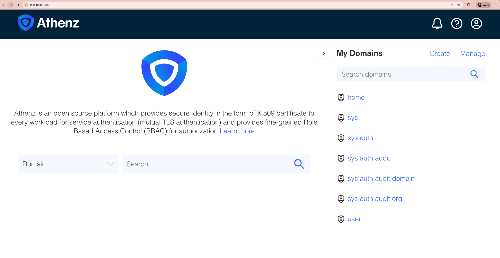

# TODO: TITLE ME

<!-- TOC -->

- [TODO: TITLE ME](#todo-title-me)
  - [Goal](#goal)
  - [Setup](#setup)
    - [Setup: Local Kubernetes Cluster w/ Kind](#setup-local-kubernetes-cluster-w-kind)
      - [Check](#check)
    - [Setup: Athenz Server in Kubernetes Cluster](#setup-athenz-server-in-kubernetes-cluster)
      - [Check](#check-1)
  - [Exp1: Create a d](#exp1-create-a-d)

<!-- /TOC -->


## Goal

The temporary goal is to build a cluster with Athenz installed, and see


🟡 TODO: The following is temporary:

You guys want to leanr about it but have no idea right? here is the tutorial for you all :)

The goal of this document is to setup a syncer mechanism between Athenz and Kubernettes RBAC by:
- Make really 
- Make a custom syncer that syncs from Athenz to K8s RBAC (Good Challenge & Learn a lot about both Athenz and K8s RBAC) only by ZMS
- Then learn how to deploy k8s-athenz-syncer properly with good UI UX and how it is differ
- We can also see what is better and what is missing in the k8s-athenz-sycner and possibly contribute back.
- Maybe I can mock creating the same cluster!

1. Create the similar one only with ZMS API and see how it affects the k8s-athenz-syncer

- /domain?prefix={athenzDomain}   (ex: /domain?prefix=shared-kubernetes-cluster-helper)
- /domain/{domainName}/role/{roleName}?auditLog=true&expand=true


1. Learn about the core logic of https://github.com/AthenZ/k8s-athenz-syncer with deployment examples
1. Maybe create a very simple deployer for the k8s-athenz-syncer with good UI UX to really make others be able to test => Learn a lot from athenz distribution as I can test Athenz so easy.


🟡 Everything above is temporary (note purpose)


## Setup

### Setup: Local Kubernetes Cluster w/ Kind

First of all, we need a kubernetes cluster running locally. We will use `kind` (Kubernetes IN Docker) to create a local cluster.


https://kind.sigs.k8s.io/

```sh
kind create cluster

# Creating cluster "kind" ...
#  ✓ Ensuring node image (kindest/node:v1.34.0) 🖼
#  ✓ Preparing nodes 📦
#  ✓ Writing configuration 📜
#  ✓ Starting control-plane 🕹️
#  ✓ Installing CNI 🔌
#  ✓ Installing StorageClass 💾
# Set kubectl context to "kind-kind"
# You can now use your cluster with:

# kubectl cluster-info --context kind-kind

# Have a question, bug, or feature request? Let us know! https://kind.sigs.k8s.io/#community 🙂
```

#### Check

```sh
k cluster-info
# Kubernetes control plane is running at https://127.0.0.1:55629
# CoreDNS is running at https://127.0.0.1:55629/api/v1/namespaces/kube-system/services/kube-dns:dns/proxy

# To further debug and diagnose cluster problems, use 'kubectl cluster-info dump'.
```

### Setup: Athenz Server in Kubernetes Cluster

Let's first setup the basic Athenz environment. We will use @ctyano's `athenz-distribution` repository:

```sh
test_name=athenz_distribution
tmp_dir=$(date +%y%m%d_%H%M%S_$test_name)
mkdir -p ~/test_dive/
cd ~/test_dive

git clone https://github.com/ctyano/athenz-distribution.git $tmp_dir
cd $tmp_dir
make clean-kubernetes-athenz deploy-kubernetes-athenz

# Lots of log ...
# kubectl apply -k athenz-ui/kustomize
# namespace/athenz unchanged
# configmap/athenz-ui-config created
# secret/athenz-admin-keys configured
# secret/athenz-ui-keys created
# service/athenz-ui created
# deployment.apps/athenz-ui created
```


#### Check

Let's do this:

```sh
kubectl -n athenz port-forward deployment/athenz-ui 3000:3000

# Forwarding from 127.0.0.1:3000 -> 3000
# Forwarding from [::1]:3000 -> 3000
```

Then open up your browser and go to `http://localhost:3000`. You should see the Athenz UI page:




## Exp1: Create a d