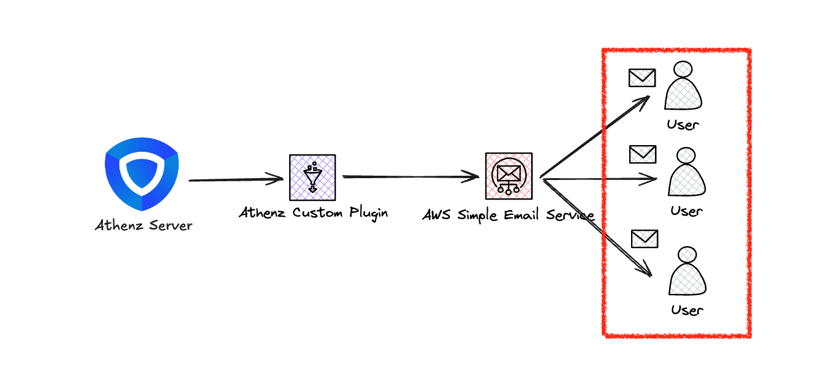
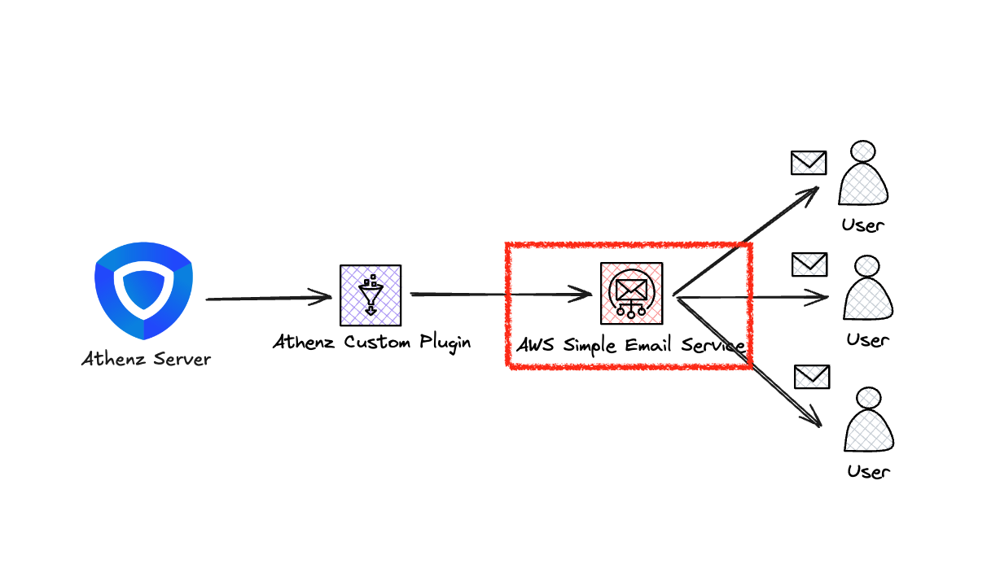
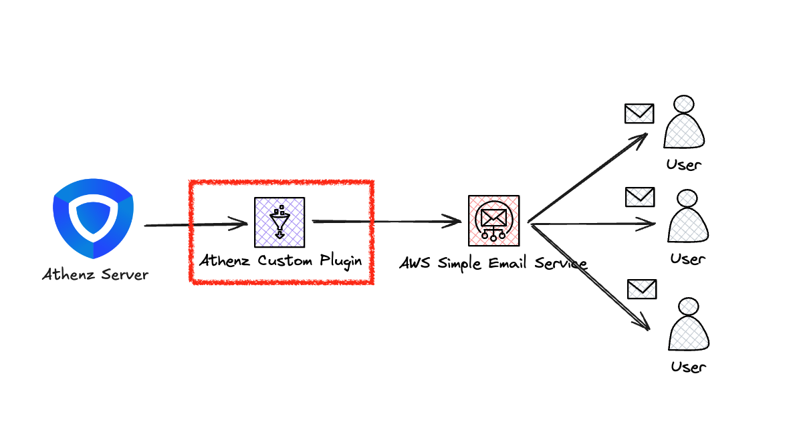
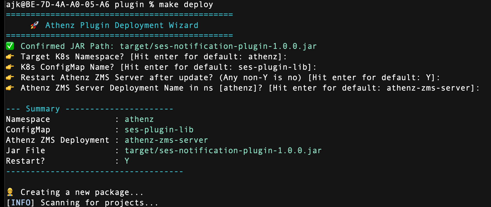
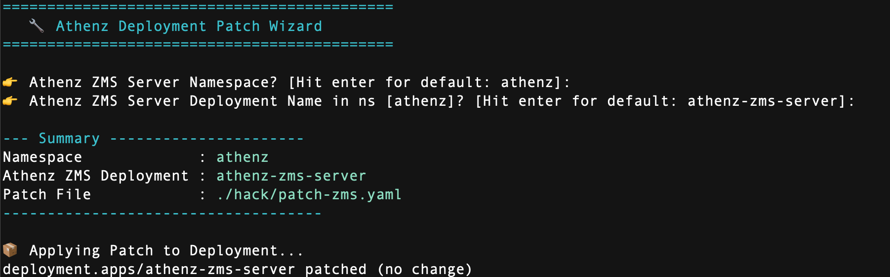

# Goal

> [!TIP]
> In hurry? Jump directly to [Result](#result) section to see the outcome of this dive.

I’ve been diving into [Athenz](https://github.com/AthenZ/athenz), an open-source RBAC/ABAC platform, running it on a local Kubernetes ([Kind](https://kind.sigs.k8s.io/)) cluster. Everything was working great until I needed to test the approval workflow.

I looked through official documentations and found out [this "Email Notifications - Athenz"](https://athenz.github.io/athenz/email_notifications/), and they tell me that you can simply utilize already built AWS SES integration if you *only* run your Athenz server on AWS infrastructure, but I was running it locally. So, I had to figure out how to make it work on my own.

The official doc also mentioned as the following that you can build your own notification plugin, so I decided to give it a try:

> This requires Athenz to be deployed on AWS. Users may use other Email Providers by following the steps to Enable [Notifications using other Providers](https://athenz.github.io/athenz/email_notifications/#enable-notifications-using-other-providers)

# General Architecture

This is the general architecture of how the `Athenz Custom Plugin` works:


# Table of Contents

<!-- TOC -->

- [Goal](#goal)
- [General Architecture](#general-architecture)
- [Table of Contents](#table-of-contents)
- [Result](#result)
- [Setup](#setup)
  - [Setup: Working directory](#setup-working-directory)
  - [Setup: Athenz and Local Kubernetes Cluster](#setup-athenz-and-local-kubernetes-cluster)
  - [Setup: Clone Athenz Plugin](#setup-clone-athenz-plugin)
  - [Setup: AWS SES Recipient Setup](#setup-aws-ses-recipient-setup)
    - [Setup: Open AWS SES Console](#setup-open-aws-ses-console)
  - [Setup: Get AWS SES SMTP Credentials](#setup-get-aws-ses-smtp-credentials)
    - [Setup: Get Smtp credentials](#setup-get-smtp-credentials)
  - [Setup: Create secret for AWS SES](#setup-create-secret-for-aws-ses)
  - [Setup: Build jar and deploy plugin as configmap in Kubernetes](#setup-build-jar-and-deploy-plugin-as-configmap-in-kubernetes)
  - [Setup: Modify Athenz ZMS Server Deployment to use the Plugin and Secret](#setup-modify-athenz-zms-server-deployment-to-use-the-plugin-and-secret)
  - [Verify: Does it work?](#verify-does-it-work)
- [What I learned](#what-i-learned)
  - [What's Next?](#whats-next)
- [Dive Hours: 9.25h](#dive-hours-925h)
- [Closing](#closing)

<!-- /TOC -->

# Result

I have successfully built and deployed a custom Athenz notification plugin that integrates with **AWS SES**. The plugin monitors specific Athenz events—such as role membership changes or domain modifications—and triggers email notifications via AWS SES.

The following GIF demonstrates the end-to-end workflow:

1. **Filter Logs**: Search for `AWS` to isolate logs related to the **AWS SES Plugin**.
1. **Configure Recipient**: Add a recipient by defining a `user.<identifier>` rule (e.g., adding `user.jkim67cloud` maps to `jkim67cloud@gmail.com`). (Only supports `gmail.com` for now)
1. **Create Role**: Create a new role that requires an **approval review**.
1. **Request Membership**: Attempt to add `user.test` as a member to the role.
1. **Trigger Notification**: The ZMS Server detects the pending request and triggers a notification to the role administrators.
1. **Verify Email**: Check the inbox to confirm the receipt of the notification email sent via AWS SES.


# Setup

## Setup: Working directory

```sh
test_name=email_notification_plugin
tmp_dir=$(date +%y%m%d_%H%M%S_$test_name)
mkdir -p ~/test_dive/$tmp_dir
cd ~/test_dive/$tmp_dir
```

## Setup: Athenz and Local Kubernetes Cluster

> [!TIP]
> Soon we are coming with the local cluster + Athenz server setup guide! Meanwhile, please refer to the following guides

- Local k8s server setup guide: https://dev.to/mlajkim/stop-using-magic-building-a-kubernetes-operator-from-scratch-mo2#a-local-kubernetes-cluster-kind
- Local athenz server setup guide: https://dev.to/mlajkim/stop-using-magic-building-a-kubernetes-operator-from-scratch-mo2#b-deploy-athenz-server

## Setup: Clone Athenz Plugin

```sh
git clone https://github.com/mlajkim/athenz-amazon-ses-notification-plugin.git plugin
```

## Setup: AWS SES Recipient Setup

First, we need to set up **trusted** email addresses in AWS SES. AWS restricts sending emails to unverified addresses to prevent them from being flagged as spam. Therefore, we must first verify the email addresses we intend to use. For this example, we will simply use our personal email address:




### Setup: Open AWS SES Console


Open [Amazon SES Console's identity management page](https://ap-northeast-1.console.aws.amazon.com/ses/home?region=ap-northeast-1#/identities), and hit the `Create identity` button:


Select `Email address` as identity type, and input your personal email address that you want to use it as the recipient of Athenz notification emails:


You will shortly receive a verification email from AWS SES. Open the email and click the `Verify email address` button to complete the verification process:


## Setup: Get AWS SES SMTP Credentials

For Athenz Server to connect to the public AWS SES service, we need to create SMTP credentials that Athenz server will use to authenticate itself when sending emails via AWS SES:




### Setup: Get Smtp credentials

Click `Create SMTP Credentials` button on the [SMTP Settings page](https://ap-northeast-1.console.aws.amazon.com/ses/home?region=ap-northeast-1#/smtp):


Store the generated username and password somewhere safe, as we will need them later when creating Kubernetes secret:


## Setup: Create secret for AWS SES

With the `STMP Username` and `SMTP Password` we just created, we can now create a Kubernetes secret that will store these credentials securely. The plugin repo contains a Makefile target that automates this process for us. Simply run the following command:

```sh
make -C plugin create-aws-ses-secret
```


## Setup: Build jar and deploy plugin as configmap in Kubernetes



We will build the plugin (as RedBox) jar file and deploy it as a configmap in our local Kubernetes cluster. The plugin repo contains a Makefile target that automates this process for us. Simply run the following command:

```sh
make -C plugin deploy
```



## Setup: Modify Athenz ZMS Server Deployment to use the Plugin and Secret

We have the following ready so far:
- AWS SES SMTP Credentials stored as Kubernetes Secret
- Athenz Notification Plugin stored as Kubernetes ConfigMap

Now we need to let ZMS Server know about these resources by modifying its deployment manifest. The plugin repo contains a Makefile target that automates this process for us. Simply run the following command:

```sh
make -C plugin patch
```



## Verify: Does it work?

Please refer to the [Result](#result) section above to see the verification steps and outcome.

# What I learned

Through this project, I gained hands-on experience in extending a complex open-source platform and integrating it with cloud infrastructure.

- **Plugin Injection & Classpath**: I discovered that Athenz supports custom plugin injection via the `USER_CLASSPATH` environment defined path variable. This allows for seamless integration of custom logic into a running ZMS server without modifying the core codebase
- **AWS SES Integration**: Successfully implemented a real-world email notification workflow using AWS SES, gaining a deeper understanding of SMTP authentication and identity verification
- **Enhanced Developer UX**: I focused on improving the CLI experience by adding color-coded outputs and streamlined Makefile targets, making the deployment process more intuitive
- **Scripting & Database Exploration**: Refined my automation skills by improving `hack` scripts and performed direct hands-on database queries within the Athenz DB to verify internal data states.
- **Visual Documentation**: Utilized [Excalidraw](https://excalidraw.com) to create technical diagrams, recognizing that visual aids significantly improve the readability and accessibility of complex architectures.

## What's Next?

As I reflect on this dive, I plan to create a robust, "one-click" Makefile that orchestrates the entire Kubernetes cluster and Athenz server setup.

# Dive Hours: 9.25h

This post took me approximately 9.25 hours of focused work and development, broken down as follows:

- `1/5/26`: 5.25h
- `1/6/26`: 4h

With the separate PRs of the following:

- [Feat: plugin that works with Athenz v1.12.31 #1](https://github.com/mlajkim/athenz-amazon-ses-notification-plugin/pull/1)
- [Feat: automated makefile for easier setup #2](https://github.com/mlajkim/athenz-amazon-ses-notification-plugin/pull/2)

# Closing

If you enjoyed this deep dive, please leave a like & subscribe for more!


