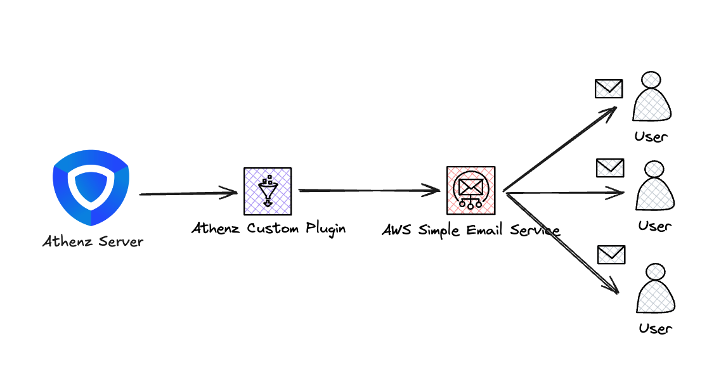

# Goal

I’ve been diving into [Athenz](https://github.com/AthenZ/athenz), an open-source RBAC/ABAC platform, running it on a local Kubernetes ([Kind](https://kind.sigs.k8s.io/)) cluster. Everything was working great until I needed to test the approval workflow.

I looked through official documentations and found out [this "Email Notifications - Athenz"](https://athenz.github.io/athenz/email_notifications/), and they tell me that you can simply utilize already built AWS SES integration if you *only* run your Athenz server on AWS infrastructure, but I was running it locally. So, I had to figure out how to make it work on my own.

The official doc also mentioned as the following that you can build your own notification plugin, so I decided to give it a try:

> This requires Athenz to be deployed on AWS. Users may use other Email Providers by following the steps to Enable [Notifications using other Providers](https://athenz.github.io/athenz/email_notifications/#enable-notifications-using-other-providers)

# General Architecture

This is the general architecture of how the `Athenz Custom Plugin` works:

# Table of Contents

<!-- TOC -->

- [Goal](#goal)
- [General Architecture](#general-architecture)
- [Table of Contents](#table-of-contents)
- [Result](#result)

<!-- /TOC -->

# Result

I was able to successfully build and deploy the custom Athenz notification plugin that integrates with AWS SES for sending email notifications. The plugin listens for specific events in Athenz, such as role membership changes or domain modifications, and triggers email notifications through AWS SES.

