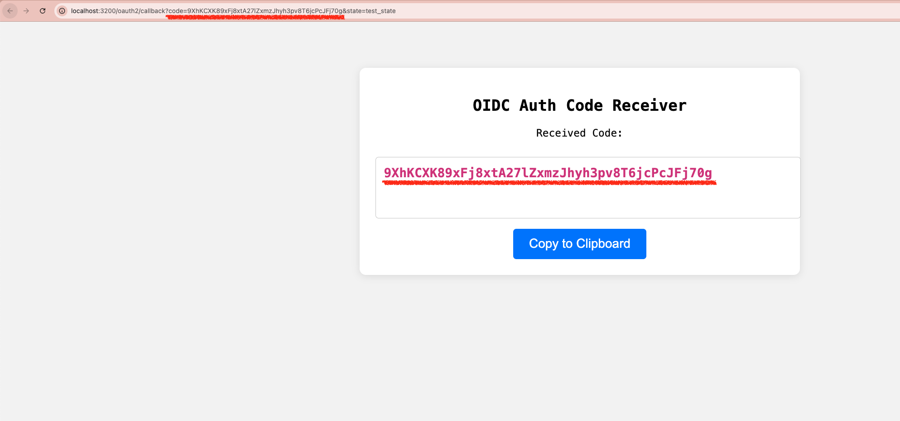

# Goal


## Result

Running the following code:

```sh
python3 ./weekly_dives/athenz_okta/week_02_2026/_get_auth.py
```

Will open up the following UI:



## Setup: 3100 port server

> [!TIP]
> - To forward: `nohup kubectl -n default port-forward deployment/auth-helper 3200:3200 > /dev/null 2>&1 &`
> - To check current jobs: `ps -ef | grep "port-forward"`
> - To kill later: `kill -9 <PID>`

Run the following command to setup the quick small server

```yaml
cat <<EOF | kubectl apply -f -
apiVersion: v1
kind: ConfigMap
metadata:
  name: auth-helper-script
  namespace: default
data:
  # Simple Python HTTP Server with copy-paste UI
  server.py: |
    import http.server
    import socketserver
    import urllib.parse

    PORT = 3200

    class Handler(http.server.SimpleHTTPRequestHandler):
        def do_GET(self):
            # Parse query parameters to extract 'code'
            parsed_path = urllib.parse.urlparse(self.path)
            query_params = urllib.parse.parse_qs(parsed_path.query)
            
            # Default message if code is not found
            code_value = "Waiting for code..."
            display_style = "color: gray;"
            
            if 'code' in query_params:
                code_value = query_params['code'][0]
                display_style = "color: #d63384; font-weight: bold;"

            # HTML Template with JavaScript for one-click copy
            html_content = f"""
            <!DOCTYPE html>
            <html>
            <head>
                <title>Auth Code Helper</title>
                <style>
                    body {{ font-family: monospace; text-align: center; padding-top: 50px; background: #f4f4f4; }}
                    .container {{ background: white; padding: 20px; border-radius: 8px; box-shadow: 0 2px 10px rgba(0,0,0,0.1); display: inline-block; }}
                    textarea {{ width: 100%; font-size: 16px; padding: 10px; margin-top: 10px; border: 1px solid #ccc; border-radius: 4px; resize: none; {display_style} }}
                    button {{ background: #007bff; color: white; border: none; padding: 10px 20px; font-size: 16px; cursor: pointer; border-radius: 4px; margin-top: 10px; }}
                    button:active {{ background: #0056b3; }}
                </style>
            </head>
            <body>
                <div class="container">
                    <h2>OIDC Auth Code Receiver</h2>
                    <p>Received Code:</p>
                    <textarea id="auth-code" rows="3" cols="50" readonly>{code_value}</textarea>
                    <br>
                    <button onclick="copyCode()">Copy to Clipboard</button>
                </div>
                <script>
                    function copyCode() {{
                        var copyText = document.getElementById("auth-code");
                        copyText.select();
                        copyText.setSelectionRange(0, 99999); 
                        navigator.clipboard.writeText(copyText.value).then(function() {{
                            alert("Copied: " + copyText.value.substring(0, 10) + "...");
                        }});
                    }}
                </script>
            </body>
            </html>
            """

            # Send headers and response
            self.send_response(200)
            self.send_header("Content-type", "text/html")
            self.end_headers()
            self.wfile.write(html_content.encode('utf-8'))

    # Start the server without threading for simplicity in container
    with socketserver.TCPServer(("", PORT), Handler) as httpd:
        print(f"Serving on port {PORT}")
        httpd.serve_forever()

---
apiVersion: apps/v1
kind: Deployment
metadata:
  name: auth-helper
  namespace: default
spec:
  replicas: 1
  selector:
    matchLabels:
      app: auth-helper
  template:
    metadata:
      labels:
        app: auth-helper
    spec:
      containers:
      - name: python-server
        image: python:3.11-alpine
        command: ["python", "/app/server.py"]
        ports:
        - containerPort: 3200
        volumeMounts:
        - name: script-volume
          mountPath: /app
      volumes:
      - name: script-volume
        configMap:
          name: auth-helper-script

---
apiVersion: v1
kind: Service
metadata:
  name: auth-helper
  namespace: default
spec:
  selector:
    app: auth-helper
  ports:
    - protocol: TCP
      port: 3200
      targetPort: 3200
  type: ClusterIP
EOF

```