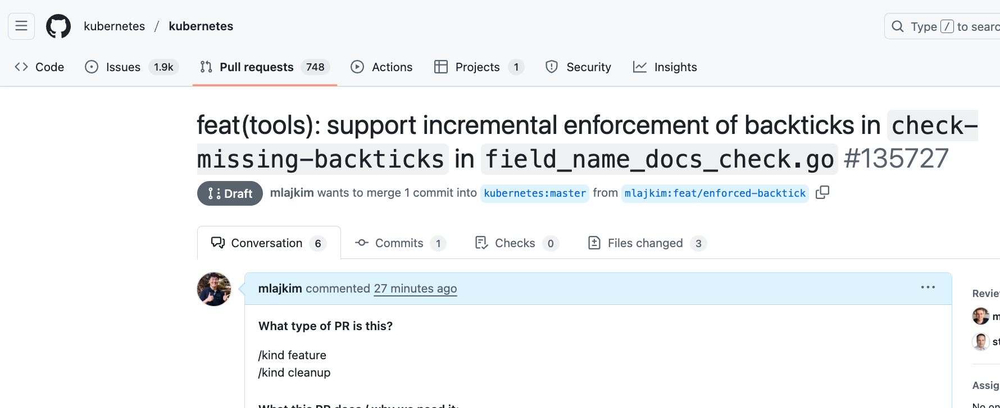

# Week 50, 2025 Weekly Dive

<!-- TOC -->

- [Week 50, 2025 Weekly Dive](#week-50-2025-weekly-dive)
  - [Goal of this week](#goal-of-this-week)
  - [Conclusion](#conclusion)
  - [Where do we dive this week?](#where-do-we-dive-this-week)
  - [What can I do as a first time contributor?](#what-can-i-do-as-a-first-time-contributor)
  - [What is fieldnamedocscheck?](#what-is-fieldnamedocscheck)
  - [Where is fieldnamedocscheck used?](#where-is-fieldnamedocscheck-used)
    - [Zero-brain Run `verify-fieldname-docs.sh`](#zero-brain-run-verify-fieldname-docssh)
      - [Dissects each code of the 60 lines of sh](#dissects-each-code-of-the-60-lines-of-sh)
        - [Dissection: Safety check](#dissection-safety-check)
        - [Dissection: KUBE_ROOT setup](#dissection-kube_root-setup)
          - [Di-Dissection: Can you run somewhere else with this logic?](#di-dissection-can-you-run-somewhere-else-with-this-logic)
          - [We can't fix the path issue](#we-cant-fix-the-path-issue)
        - [Dissection: go language check](#dissection-go-language-check)
        - [Dissection: store every type.go](#dissection-store-every-typego)
  - [Zero-brain Run fieldnamedocekscheck](#zero-brain-run-fieldnamedocekscheck)
  - [What is that `-s` flag?](#what-is-that--s-flag)
    - [Can we get a help command for that `-s` flag, without looking at the source code?](#can-we-get-a-help-command-for-that--s-flag-without-looking-at-the-source-code)
  - [Successfully run with `-s`!](#successfully-run-with--s)
  - [Dissects the core logic](#dissects-the-core-logic)
    - [Dissection: Store all the field names in lower case](#dissection-store-all-the-field-names-in-lower-case)
    - [Dissection: Understand what's inside the variables](#dissection-understand-whats-inside-the-variables)
  - [Check if the go file actually works](#check-if-the-go-file-actually-works)
  - [Understand TODOs](#understand-todos)
  - [What's next?: Create a sample enforcing mechanism](#whats-next-create-a-sample-enforcing-mechanism)
    - [Returned 1402 lines of errors just for one file](#returned-1402-lines-of-errors-just-for-one-file)
  - [What's next?: Create a auto lint fixer](#whats-next-create-a-auto-lint-fixer)
  - [Create a linter](#create-a-linter)
  - [Apply the code](#apply-the-code)
  - [Find the smallest code](#find-the-smallest-code)
  - [Realize that the changes are too big and go beyond expected](#realize-that-the-changes-are-too-big-and-go-beyond-expected)
  - [Let's see if others have worked on this](#lets-see-if-others-have-worked-on-this)
  - [Create PR, even if it is WIP](#create-pr-even-if-it-is-wip)
  - [Signs](#signs)

<!-- /TOC -->

## Goal of this week

The goal of this week is to make my first contribution to kubernetes project.

## Conclusion

>[!NOTE]
> Not yet completed, still working on it :)

I have successfully made a PR here: TODO LINK

## Where do we dive this week?

I want to be a part of Contributor in kubernetes


And eventually have the `@kubernetes` handle in GitHub:


## What can I do as a first time contributor?

So I've git cloned the kubernetes repository without thinking too much, but still have no idea what to fix.

So I asked AI inside the project, what kind of things I can fix as a first time contributor (basically easy stuff)

And the AI has found this todo inside `fieldnamedocscheck`:

```go
// TODO: a manual pass adding back-ticks to the doc strings, then update the linter to
// TODO: check the existence of back-ticks
```

First of all I have no idea what this field_name_docs_check.go does so ... let's just dive in without knowing anything :)

## What is fieldnamedocscheck?

It seems like it checks if the fields in the types are properly documented or not.

## Where is fieldnamedocscheck used?

So what is fieldnamedocscheck? Let see where this cmd `fieldnamedocscheck` is used:


### Zero-brain Run `verify-fieldname-docs.sh`

> ![NOTE]
> You may be asked to run `brew install bash` if your bash version is insufficient

This script has checked 64 lines of output:

```sh
./hack/verify-fieldname-docs.sh
# Checking ./staging/src/k8s.io/kube-aggregator/pkg/apis/apiregistration/v1
# Checking ./staging/src/k8s.io/kube-aggregator/pkg/apis/apiregistration/v1beta1
# Checking ./staging/src/k8s.io/apiextensions-apiserver/pkg/apis/apiextensions/v1
# Checking ./staging/src/k8s.io/apiextensions-apiserver/pkg/apis/apiextensions/v1beta1
# Checking ./staging/src/k8s.io/api/rbac/v1
# Checking ./staging/src/k8s.io/api/rbac/v1beta1
# Checking ./staging/src/k8s.io/api/rbac/v1alpha1
# Checking ./staging/src/k8s.io/api/apiserverinternal/v1alpha1
# ...
```

#### Dissects each code of the 60 lines of sh

Let's open the `verify-fieldname-docs.sh` file and dissect each code.

##### Dissection: Safety check

```sh
set -o errexit
set -o nounset
set -o pipefail
```

- `errexit` : Exit immediately if a command exits with a non-zero status
- `nounset` : Treat unset variables as an error when substituting
- `pipefail`: Prevent errors in a pipeline from being masked


##### Dissection: KUBE_ROOT setup

> [!TIPS]
> Once you `echo $KUBE_ROOT`, you will get `./hack/..` as a sample.
> That `..` at the end
```sh
KUBE_ROOT=$(dirname "${BASH_SOURCE[0]}")/.. # i.e) ./hack/.. or ../../..
source "${KUBE_ROOT}/hack/lib/init.sh"
source "${KUBE_ROOT}/hack/lib/util.sh"
```

###### Di-Dissection: Can you run somewhere else with this logic?

In conclusion, we need to run the `verify-fieldname-docs.sh` from the base directory of kubernetes repository.

```sh
./oss_workspace/oss_kubernetes/hack/verify-fieldname-docs.sh
# KUBE_ROOT=./oss_workspace/oss_kubernetes/hack/..
# go: go.mod file not found in current directory or any parent directory; see 'go help modules'
```

```sh
../../verify-fieldname-docs.sh
# KUBE_ROOT=../../..
# stat ~/oss_workspace/oss_kubernetes/hack/hello/can/cmd/fieldnamedocscheck: directory not found
```

```sh
./verify-fieldname-docs.sh
# KUBE_ROOT=./..
# stat ~/oss_workspace/oss_kubernetes/hack/cmd/fieldnamedocscheck: directory not found
```

###### We can't fix the path issue

Since this chunk of code is used, I do not think we can modify this:


##### Dissection: go language check

Checks if golang sufficient environment is set

```sh
kube::golang::setup_env
```

##### Dissection: store every type.go

Store every `type.go` files inside `versioned_api_files` variable:

```sh
versioned_api_files=$(find_files) || true
```


## Zero-brain Run fieldnamedocekscheck

> ![NOTE]
> It is important to give a shot even if you don't know what you are doing :)

```sh
cd ./cmd/fieldnamedocscheck
go run field_name_docs_check.go
# F1211 11:49:45.848446   80482 field_name_docs_check.go:33] Please define -s flag as it is the api type file
# exit status 255
```

## What is that `-s` flag?

Not officially, probably, it is a type source file, it seems:

```go
typeSrc = flag.StringP("type-src", "s", "", "From where we are going to read the types")
```

```go
if *typeSrc == "" {
  klog.Fatalf("Please define -s flag as it is the api type file")
}
```

### Can we get a help command for that `-s` flag, without looking at the source code?

```sh
go run field_name_docs_check.go --help
Usage of ~/Library/Caches/go-build/81/..hash../-d/field_name_docs_check:
  -s, --type-src string   From where we are going to read the types
```


## Successfully run with `-s`!

>[!NOTE]
> If nothing happens, it means all the fields are properly documented :)

```sh
go run field_name_docs_check.go -s ../../staging/src/k8s.io/api/core/v1/types.go
```

## Dissects the core logic

### Dissection: Store all the field names in lower case

```go
if p.Name != "" {
  typesMap[strings.ToLower(p.Name)] = p
}

// Sample keys:
// key: ipfamilypolicy  key: trafficdistribution  key: externalips ...
```

To find all the fields, including right and wrong ones, we store all the field names in lower case inside `typesMap`.

### Dissection: Understand what's inside the variables

```go
TCPSocket *TCPSocketAction `json:"tcpSocket,omitempty" protobuf:"bytes,3,opt,name=tcpSocket"`
```

```sh
Struct: TCPSocketAction
p.Name:  tcpSocket
typesMap: tcpsocket
```

## Check if the go file actually works

It seems like it checks only when it has the back-tick quoted field names in the doc string.

So I've set up `TCPSocket` => `TcPSocket`, and created a new sentence `// TcPSocket is deprecated and...`

```go
// LifecycleHandler defines a specific action that should be taken in a lifecycle
// hook. One and only one of the fields, except `TcPSocket` must be specified.
// `TcPSocket` is deprecated and not supported as a LifecycleHandler.
type LifecycleHandler struct {
  // Deprecated. `TcPSocket` is NOT supported as a LifecycleHandler and kept
  // for backward compatibility. There is no validation of this field and
  // lifecycle hooks will fail at runtime when it is specified.
  // +optional
  TCPSocket *TCPSocketAction `json:"tcpSocket,omitempty" protobuf:"bytes,3,opt,name=tcpSocket"`
}
```

And got two errors (Note that even if there are three places of `TcPSocket`, it only shows two errors because the second rule skips the already found mismatched names):

```sh
go run field_name_docs_check.go -s ../../staging/src/k8s.io/api/core/v1/types.go
# Error: doc for LifecycleHandler contains: TcPSocket, which should be: tcpSocket
# Error: doc for LifecycleHandler.tcpSocket contains: TcPSocket, which should be: tcpSocket
# exit status 1
```

## Understand TODOs

```go
// The rule is:
// 1. Get all back-tick quoted names in the doc
// 2. Skip the name which is already found mismatched.
// 3. Skip the name whose lowercase is different from the lowercase of tag names,
//    because some docs use back-tick to quote field value or nil
// 4. Check if the name is different from its tag name

// TODO: a manual pass adding back-ticks to the doc strings, then update the linter to
// TODO: check the existence of back-ticks
```

Right now, setting the `back-ticks` is not mandatory, but the TODO suggests that we should add back-ticks to the doc strings, and then update the linter to check the existence of back-ticks.

## What's next?: Create a sample enforcing mechanism

I created the following enforcing mechanism to make sure all the field names are properly documented with back-ticks:

```go
package main

import (
	"fmt"
	"os"
	"regexp"
	"strings"

	flag "github.com/spf13/pflag"
	kruntime "k8s.io/apimachinery/pkg/runtime"
	"k8s.io/apimachinery/pkg/util/sets"
	"k8s.io/klog/v2"
)

var (
	typeSrc    = flag.StringP("type-src", "s", "", "From where we are going to read the types")
	re         = regexp.MustCompile("`(\\b\\w+\\b)`")
	reAllWords = regexp.MustCompile("\\b\\w+\\b")
)

// kubeTypesMap is a map from field name to its tag name and doc.
type kubeTypesMap map[string]kruntime.Pair

func main() {
	flag.Parse()

	if *typeSrc == "" {
		klog.Fatalf("Please define -s flag as it is the api type file")
	}

	docsForTypes := kruntime.ParseDocumentationFrom(*typeSrc)
	rc := false

	for _, ks := range docsForTypes {
		typesMap := make(kubeTypesMap)

		for _, p := range ks[1:] {
			// skip the field with no tag name
			if p.Name != "" {
				typesMap[strings.ToLower(p.Name)] = p
			}
		}

		structName := ks[0].Name

		rc = checkFieldNameAndDoc(structName, "", ks[0].Doc, typesMap) || rc
		for _, p := range ks[1:] {
			rc = checkFieldNameAndDoc(structName, p.Name, p.Doc, typesMap) || rc
		}
	}

	if rc {
		os.Exit(1)
	}
}

func checkFieldNameAndDoc(structName, fieldName, doc string, typesMap kubeTypesMap) bool {
	rc := false
	visited := sets.Set[string]{}

	// The rule is:
	// 1. Get all back-tick quoted names in the doc
	// 2. Skip the name which is already found mismatched.
	// 3. Skip the name whose lowercase is different from the lowercase of tag names,
	//    because some docs use back-tick to quote field value or nil
	// 4. Check if the name is different from its tag name
	// 5. Check if there are any unquoted field names in the doc

	nameGroups := re.FindAllStringSubmatch(doc, -1)
	for _, nameGroup := range nameGroups {
		name := nameGroup[1]
		if visited.Has(name) {
			continue
		}
		if p, ok := typesMap[strings.ToLower(name)]; ok && p.Name != name {
			rc = true
			visited.Insert(name)

			fmt.Fprintf(os.Stderr, "Error (Case Mismatch): doc for %s", structName)
			if fieldName != "" {
				fmt.Fprintf(os.Stderr, ".%s", fieldName)
			}

			fmt.Fprintf(os.Stderr, " contains: %s, which should be: %s\n", name, p.Name)
		}
	}

	wordIndices := reAllWords.FindAllStringIndex(doc, -1)

	for _, loc := range wordIndices {
		start, end := loc[0], loc[1]
		word := doc[start:end]

		p, isField := typesMap[strings.ToLower(word)]
		if !isField {
			continue
		}

		if visited.Has(word) {
			continue
		}

		hasBacktick := false
		if start > 0 && end < len(doc) {
			if doc[start-1] == '`' && doc[end] == '`' {
				hasBacktick = true
			}
		}

		if !hasBacktick {
			rc = true
			visited.Insert(word)

			fmt.Fprintf(os.Stderr, "Error (Missing Backticks): doc for %s", structName)
			if fieldName != "" {
				fmt.Fprintf(os.Stderr, ".%s", fieldName)
			}
			fmt.Fprintf(os.Stderr, " mentions field %s without backticks. Should be: `%s`\n", word, p.Name)
		}
	}

	return rc
}
```

### Returned 1402 lines of errors just for one file

I got `1,402` lines of errors:

```sh
go run field_name_docs_check.go -s ../../staging/src/k8s.io/api/core/v1/types.go
# Error (Missing Backticks): doc for AWSElasticBlockStoreVolumeSource.volumeID mentions field volumeID without backticks. Should be: `volumeID`
# Error (Missing Backticks): doc for AWSElasticBlockStoreVolumeSource.fsType mentions field fsType without backticks. Should be: `fsType`
# Error (Missing Backticks): doc for AWSElasticBlockStoreVolumeSource.partition mentions field partition without backticks. Should be: `partition`
```


## What's next?: Create a auto lint fixer

There is no way that I manually fix `1,402` lines of errors, and this applies for only 1 file.

Also, even after I fix this somehow, if someone else adds a new field without back-ticks, BEFORE I enforce the back-ticks check, the problem will happen again.

Therefore, I think it is better, if I make a mechanism that enforces one page first, and then eventually scope out to the entire repository.

Also there are some words like, `name`, `type`, `kind`, etc, that are used very often in the doc strings, but they are ALSO field names. That case, we need to have some kind of AI mechanism to figure out whether it is a field name or just a normal word.


## Create a linter

TODO: Write code here

## Apply the code

```sh
go run field_name_docs_check_lint.go -s ../../staging/src/k8s.io/api/core/v1/types.go
# ✅ Successfully fixed backticks in: ../../staging/src/k8s.io/api/core/v1/types.go
```

## Find the smallest code

I do not want to scare them but also want them to merge the PR & somewhat has dependency in my changes later in the future.

So maybe enforcing one file first with the smallest lines of code is a good idea:s

```sh
find staging/src/k8s.io/api -name "types.go" | xargs wc -l | sort -n | head -n 5
# 48 staging/src/k8s.io/api/authentication/v1alpha1/types.go
# 75 staging/src/k8s.io/api/scheduling/v1/types.go
# 82 staging/src/k8s.io/api/scheduling/v1beta1/types.go
# 83 staging/src/k8s.io/api/imagepolicy/v1alpha1/types.go
```

## Realize that the changes are too big and go beyond expected

```go
// `azureDisk` represents an Azure Data Disk mount on the host and bind mount to the pod.
// Deprecated: `azureDisk` is deprecated. All operations for the in-tree `azureDisk` type
// are redirected to the disk.`csi`.azure.com `csi` driver.
```

The problem of the changes above:
- The link is corrupted because of the back-ticks: `disk.`csi`.azure.com` => should be `disk.csi.azure.com`
- Not sure if we can start with `azureDisk` rather than `AzureDisk` for the first word
  - It seems like the preview mode works fine, but not sure if the actual kubernetes doc generator works fine with this.


## Let's see if others have worked on this

I was not able to find one

## Create PR, even if it is WIP

It won't build but who cares. Do the zero-brain PR: https://github.com/kubernetes/kubernetes/pull/135727



I see you `Kubernetes Contributor` badge :)


##  Signs


