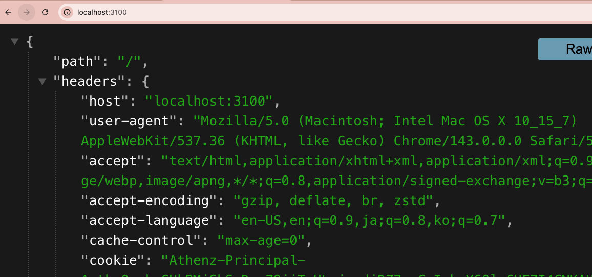

# Goal

Setup Echo Server to see the response of proxy!


## Setup: Echo Server

```yaml
cat <<EOF | kubectl apply -f -
apiVersion: apps/v1
kind: Deployment
metadata:
  name: header-debug
  namespace: athenz
  labels:
    app: header-debug
spec:
  replicas: 1
  selector:
    matchLabels:
      app: header-debug
  template:
    metadata:
      labels:
        app: header-debug
    spec:
      containers:
      - name: echo
        image: mendhak/http-https-echo
        ports:
        - containerPort: 8080
---
apiVersion: v1
kind: Service
metadata:
  name: header-debug-svc
  namespace: athenz
spec:
  ports:
  - port: 80
    targetPort: 8080
  selector:
    app: header-debug
EOF

```

## Verify: Echo Result

