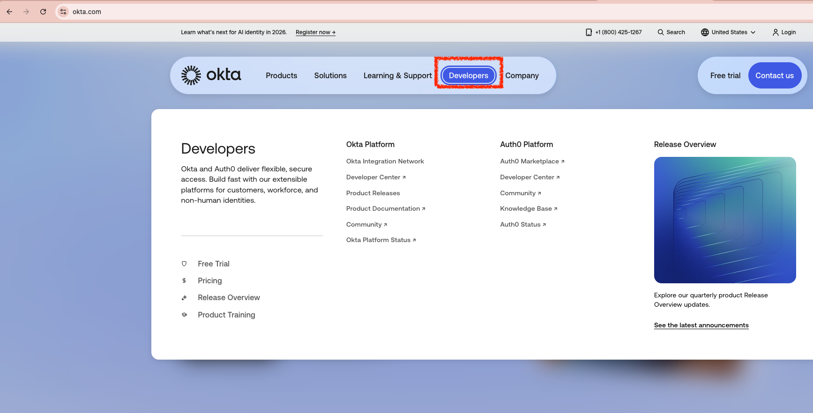
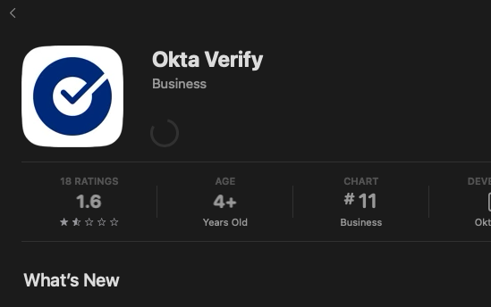
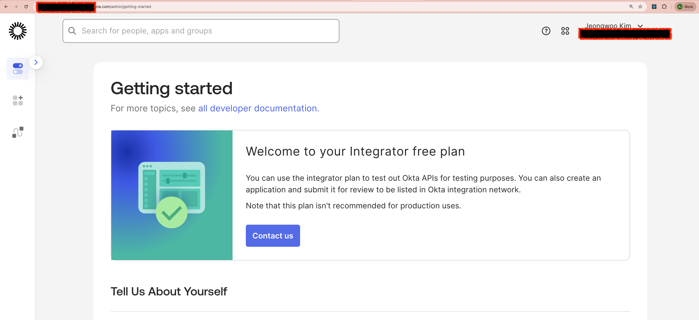
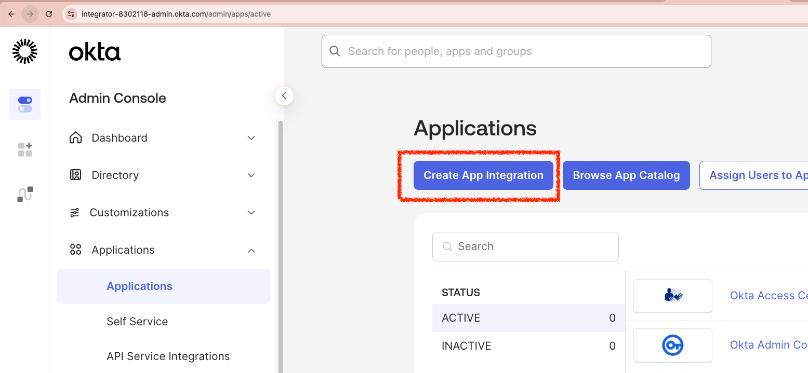
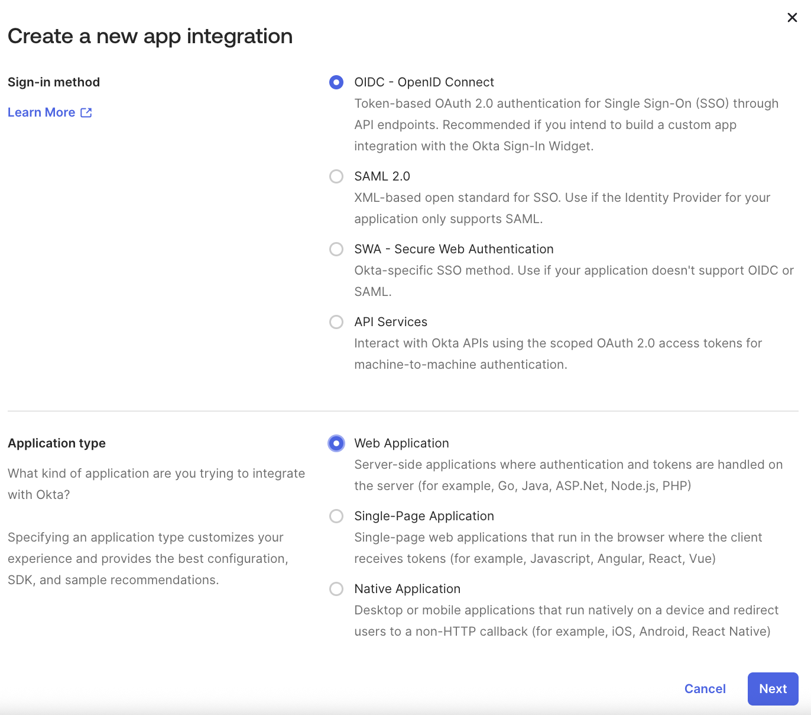
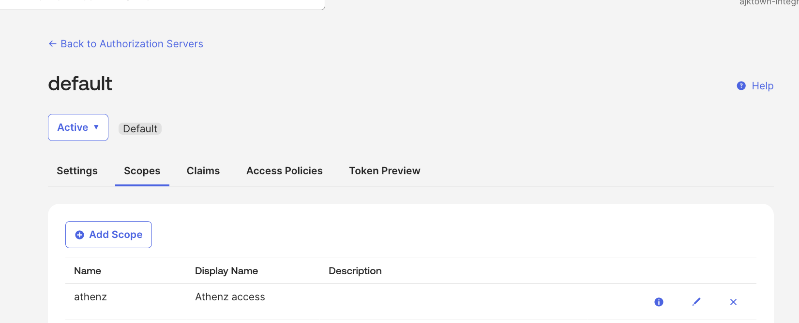
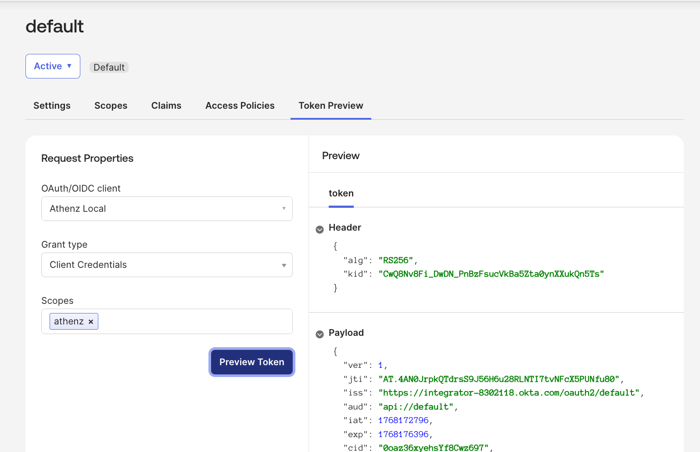
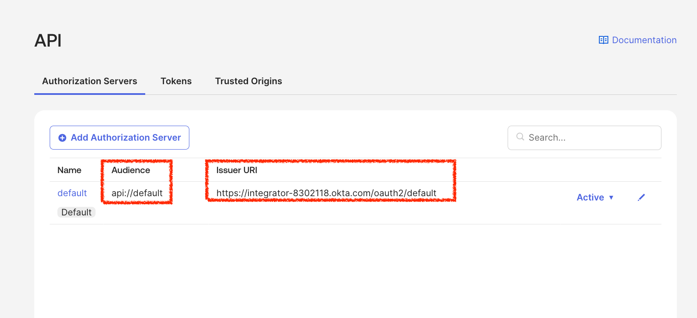

# About _raw.260112.md

This is a raw dump file for daily dive on jan-12-2026.

<!-- TOC -->

<!-- /TOC -->

# Goal: Install Okta


## Step: Get into website

I think this is my first time getting into the website:

https://www.okta.com/




## Setup: Sign up?


https://developer.okta.com/signup/

## Setup: Setting up okta

it seems like only work email works:


## Setup: Okta Verify for Mac OS

I don't want to bring my phone to work, so I will use Okta Verify for Mac OS:




### Test

Login completed!



## Setup

Let's add the email address's name as a user account so that once later we succeed in test the user has the permission.


# Goal


## Setup: Create app integration

> [!TIP]
> Official Athenz Doc: https://github.com/AthenZ/athenz/blob/master/docker/docs/IdP/Auth0.md


https://integrator-8302118-admin.okta.com/admin/apps/active

Click next with `OIDC` & `Web Application`:




- `Proof of possession`: Makes required signed token, for now we skip


## Setup


https://integrator-8302118-admin.okta.com/admin/oauth2/as


## Setup: Policy and rule, and test yourself

Create a scope `athenz`:


Test yourself:



## Setup: `sub` as athenz user service name

> [!NOTE]
> - [Source code](https://github.com/AthenZ/athenz/blob/master/libs/java/auth_core/src/main/java/com/yahoo/athenz/auth/oauth/OAuthCertBoundJwtAccessTokenAuthority.java#L100-L102) for authorized client ids not mandatory
> - [Source code](https://github.com/AthenZ/athenz/blob/master/libs/java/auth_core/src/main/java/com/yahoo/athenz/auth/oauth/OAuthCertBoundJwtAccessTokenAuthority.java#L246-L252) for using `sub` as service principal

Athenz only sees the `sub` field to define who you are. You can set up conversion field too but for now we can simply do this:


### Test


## Setup: Get Access Token


```sh
CLIENT_ID="0oaz36xyehsYf8Cwz697"
CLIENT_SECRET="PUT_YOUR_SECRET_HERE"

curl -X POST \
  -H "Content-Type: application/x-www-form-urlencoded" \
  -u "${CLIENT_ID}:${CLIENT_SECRET}" \
  "https://integrator-8302118.okta.com/oauth2/default/v1/token" \
  -d "grant_type=client_credentials" \
  -d "scope=athenz" | jq

# {
#   "token_type": "Bearer",
#   "expires_in": 3600,
#   "access_token": "CENSORED",
#   "scope": "athenz"
# }
```

## Test

```sh
TOKEN="PUT_YOUR_ACCESS_TOKEN"
curl -k -H "Authorization: Bearer $TOKEN" \
  "https://localhost:4443/zms/v1/domain"
```

## Setup: Adding ZMS properties so that ZMS can trust the okta verify



We can omit `athenz.auth.oauth.jwt.authorized_client_ids_path` because we setup the email address as the SSOT.

```sh
### Okta Configuration for ZMS ###

athenz.zms.authority_classes=com.yahoo.athenz.auth.impl.CertificateAuthority,com.yahoo.athenz.auth.impl.AuthorizedServiceAuthHeaderAuthority,com.yahoo.athenz.auth.oauth.OAuthCertBoundJwtAccessTokenAuthority

# Issuer:
athenz.auth.oauth.jwt.claim.aud=api://default
athenz.auth.oauth.jwt.claim.iss=https://integrator-8302118.okta.com/oauth2/default
athenz.auth.oauth.jwt.claim.scope=athenz

athenz.auth.oauth.jwt.parser.jwks_url=https://integrator-8302118.okta.com/oauth2/default/v1/keys
athenz.auth.oauth.jwt.auth0.claim_client_id=cid

athenz.auth.oauth.jwt.verify_cert_thumbprint=false
athenz.auth.oauth.jwt.cert.exclude_role_certificates=false

```


## Setup: Make sure to restart the ZMS server to get the changes!


```sh
kubectl rollout restart deployment/athenz-zms-server -n athenz
```

## Setup: Set k8s secret for proxy credentials

Athenz UI does not have any mechanism to handle the Oauth (completely separated) so we want to build our own proxy so that all Athenz cares is about the token stored as Cookie,

But before we do anything, we need the id and secret to represent the proxy so that proxy is trusted by Okta server. To do this correctly, we want to create a k8s secret:

```sh
printf "Enter Okta Client ID: "
read _CLIENT_ID
printf "Enter Okta Client Secret: "
read _CLIENT_SECRET
echo ""

_COOKIE_SECRET=$(openssl rand -base64 32 | tr -- '+/' '-_')
_ns="athenz"

echo "🔐 Creating Kubernetes Secret [oauth2-proxy-creds] in ns [$_ns]..."
kubectl delete secret oauth2-proxy-creds -n $_ns --ignore-not-found > /dev/null
kubectl create secret generic oauth2-proxy-creds \
  -n $_ns \
  --from-literal=client-id=${_CLIENT_ID} \
  --from-literal=client-secret=${_CLIENT_SECRET} \
  --from-literal=cookie-secret=${_COOKIE_SECRET}
```

## Setup: Create proxy container

Copy the following container spec right under the `spec.template.spec.containers` section:

```yaml

      - name: oauth2-proxy
        image: quay.io/oauth2-proxy/oauth2-proxy:latest
        ports:
        - containerPort: 3100
          name: auth-proxy
        env:
        - name: OAUTH2_PROXY_CLIENT_ID
          valueFrom:
            secretKeyRef:
              name: oauth2-proxy-creds
              key: client-id
        - name: OAUTH2_PROXY_CLIENT_SECRET
          valueFrom:
            secretKeyRef:
              name: oauth2-proxy-creds
              key: client-secret
        - name: OAUTH2_PROXY_COOKIE_SECRET
          valueFrom:
            secretKeyRef:
              name: oauth2-proxy-creds
              key: cookie-secret
        args:
        # destination of this container:
        - --upstream=http://127.0.0.1:3000/
        # this container's port, the same as the .ports[0].containerPort:
        - --http-address=0.0.0.0:3100
        # Okta setting:
        - --provider=oidc
        - --oidc-issuer-url=https://integrator-8302118.okta.com/oauth2/default
        - --email-domain=*
        # "Athenz-Principal-Auth" is the default (modifiable) cookie name
        - --cookie-name=Athenz-Principal-Auth
        - --cookie-secure=false
        - --pass-access-token=true
```

## Setup: Remove `STATIC_USER_NAME`

Remove the following line from the `spec.template.spec.containers` section, this is only for test and if you want to use the admin back, please do add them later once again:

```yaml
- name: STATIC_USER_NAME
  value: athenz_admin
```

## Setup: Modify the UI config

> [!NOTE]
> `docker/ui/conf/extended-config.js`

